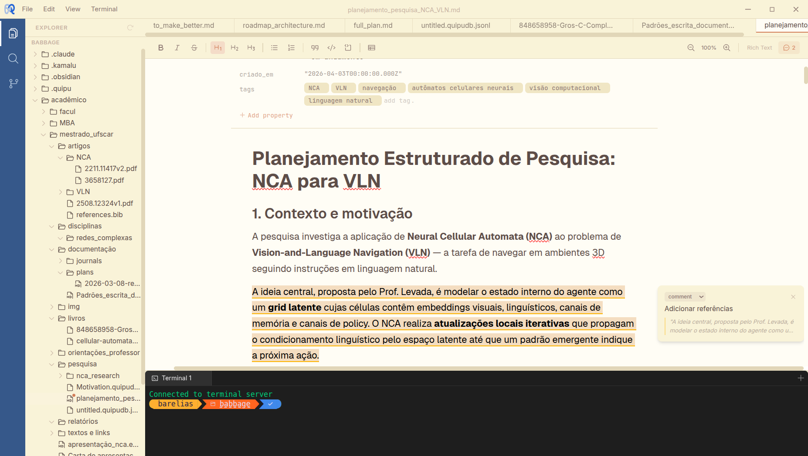

# Quipu

A knowledge manager and markdown editor with WYSIWYG editing, inline comments, and an integrated terminal. Like Obsidian meets VS Code — organize your notes, docs, and knowledge base in local markdown files, with the power of a real editor and terminal at your fingertips.



## Features

- **WYSIWYG Markdown Editing** — Rich text editing powered by TipTap. Write in a visual editor, get clean markdown output.
- **Inline Comments** — Select any text and attach a comment. Comments display in a sidebar track alongside your document.
- **Integrated Terminal** — Full shell access within the app, just like VS Code's terminal.
- **File Explorer** — Browse, create, rename, and delete files and folders from the sidebar.
- **Custom `.quipu` Format** — Saves editor state (formatting, comments, metadata) as JSON. Also reads and writes plain `.md` and `.txt` files.
- **Keyboard Shortcuts** — `Ctrl+S` to save, `Ctrl+B` to toggle sidebar.

## Tech Stack

- **Electron** — Desktop shell
- **React** + **Vite** — UI and build tooling
- **TipTap** — Rich text / WYSIWYG editor
- **xterm.js** — Terminal emulator
- **Go** — Optional backend server for browser mode

## Getting Started

```bash
# Install dependencies
npm install

# Run in development mode (Vite + Electron)
npm start
```

## Build

```bash
# Production build
npm run build

# Package as desktop app
npm run electron:pack
```

## Browser Mode

Quipu can also run in a browser with a Go backend providing file system access and a terminal over WebSocket.

```bash
npm run build
cd server && go run main.go -addr localhost:3000
```

## Project Structure

```
electron/          Electron main process and preload scripts
server/            Go backend for browser mode
src/
  components/      Editor, FileExplorer, Terminal, FolderPicker
  context/         React Context for workspace state
  services/        File system abstraction (Electron / browser)
```
