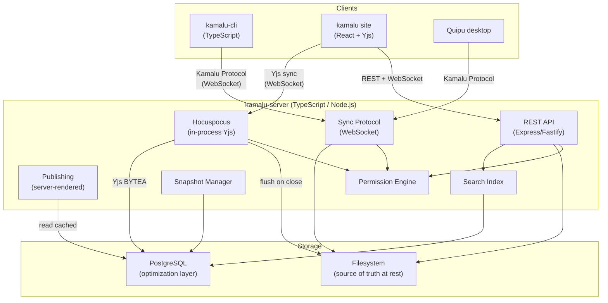

# feat: Kamalu Distributed Knowledge Management Platform

## Overview

Kamalu is a new multi-repo product: a distributed knowledge management platform combining a filesystem-first knowledge base with real-time collaborative editing, path-based permissions, partial sync, and publishing. Three repos: kamalu-server (TypeScript), kamalu-cli (TypeScript), kamalu (web site, React).

The existing Quipu codebase provides extractable components (TipTap editor, file explorer, UI primitives) that Kamalu's web UI will reuse as shared packages.

## Problem Frame

Teams accumulate knowledge across Notion, scattered docs/ folders, wikis, and blog platforms with no unified way to access slices, collaborate in realtime, control visibility, or let AI agents index relevant portions. Existing tools each solve one piece but none combines filesystem-based storage, CRDT collaboration, partial sync with permissions, and a CLI workflow. (see origin: `docs/brainstorms/2026-04-02-kamalu-knowledge-platform-requirements.md`)

## Requirements Trace

- R1. Filesystem source of truth — real .md files on server
- R2. PostgreSQL optimization layer — permissions, search, Yjs state, snapshots
- R3. FRAME annotations as sidecar .frame.json files
- R4. Google Docs-style version snapshots in PostgreSQL
- R5. Path-glob + per-document ACL permissions
- R6. Server-enforced partial sync via Kamalu protocol
- R7. Web UI respects permission model
- R8. Public content for publishing
- R9. Custom sync protocol (kamalu clone/sync/push/pull)
- R10. CLI commands for permissions, profiles, history
- R11. Shareable profiles (named path sets)
- R12. TypeScript server, multiple knowledge bases per instance, three API surfaces
- R13. Yjs document sync via Hocuspocus (in-process)
- R14. Full-text search with permission-scoped results
- R15. Bidirectional sync: web edits flush to files, CLI pushes merge into active Yjs sessions
- R16. Web UI reuses extracted Quipu components
- R17. Google Docs-style multi-cursor collab via Yjs
- R18. Publishing: designated public paths auto-publish on save
- R19. Admin UI for users, teams, permissions, profiles
- R20. Quipu desktop connects via Kamalu sync protocol
- R21. AI agent authentication and partial sync
- R22. FRAME annotations for AI context
- R23. Shared component extraction from Quipu
- R24. Description frontmatter indexed for future AI discovery

## Scope Boundaries

- **Not in scope:** Git compatibility, mobile apps, offline-first web, custom publishing themes, Notion/Confluence migration, end-to-end encryption
- **Not in scope:** Full Git-style VCS — snapshots only, no commit DAG
- **Deferred to post-MVP:** R20 (Quipu desktop integration via sync protocol — requires Quipu architecture changes), R21 (dedicated AI agent API — CLI covers basic AI access for now)
- **Deferred:** Video/audio content, analytics, plugin system, Quipu live-editing toggle, AI context engineering features (browse-before-clone, frontmatter RAG)

## Context & Research

### Relevant Code and Patterns

- `src/components/Editor.jsx` — TipTap editor, **already prop-driven** (not context-coupled). Dependencies: frameService (FRAME annotations), fileSystem (image upload only). 11 props from App.jsx. Cleanest extraction point.
- `src/components/FileExplorer.jsx` — **deeply coupled to WorkspaceContext** (destructures 11 context values). Extraction requires a provider interface.
- `src/context/WorkspaceContext.jsx` — god object (876 lines, 45+ exported values). Must be split for extraction.
- `src/services/fileSystem.js` — adapter pattern (Electron vs browser). 14 methods. Clean API shape.
- `src/extensions/` — 4 custom TipTap extensions (RevealMarkdown, BlockDragHandle, FindReplace, WikiLink). All extractable.
- `src/components/ui/` — 4 shadcn primitives. Lightweight, extractable.
- Current stack: React 19.2, Vite 7.2, TipTap v3.15-3.20, tiptap-markdown 0.9, Tailwind CSS v4.2
- Go server (`server/main.go`) — 1483 lines, stdlib net/http, gorilla/websocket. Not reusable for Kamalu; architecture reference only.

### Institutional Learnings

- **WebSocket reconnection** (`docs/solutions/integration-issues/terminal-websocket-reconnection.md`): Every WS connection needs reconnection logic with `intentionalClose` flag, max retries, and progressive UI feedback. Wrap in a reusable utility.
- **Go CORS/sandboxing** (`docs/solutions/runtime-errors/windows-cors-403-go-server-websocket.md`): Security boundaries must be explicit config, not inferred. WebSocket endpoints must pass through same middleware as REST.
- **File watcher pattern** (`docs/solutions/integration-issues/file-watcher-editor-reload-integration.md`): Use `diskContent` sentinel to distinguish own saves from external changes. Never auto-reload dirty documents.
- **FRAME sync** (`docs/solutions/integration-issues/frame-system-multi-component-sync.md`): Shared UUIDs between in-memory marks and sidecar entries. Fire-and-forget writes for sidecar I/O.

### External References

- **Hocuspocus v3.4.4**: `onAuthenticate`, `onLoadDocument`, `onStoreDocument` hooks. Database extension stores Yjs state as BYTEA in PostgreSQL. Runs in-process with Node.js.
- **TipTap Collaboration**: `@tiptap/extension-collaboration` + `@tiptap/extension-collaboration-cursor`. **Must disable built-in history** when using Yjs.
- **@tiptap/static-renderer**: Server-side ProseMirror JSON to markdown conversion without DOM. Used for flushing Yjs state to .md files.
- **Syncthing BEP**: Index exchange (file checksums + sequence numbers) + block transfer. Model for Kamalu sync protocol.
- **coder/websocket** (v1.8.14): Modern Go WebSocket library (successor to nhooyr.io/websocket). For reference if Go CLI needs WebSocket.

## Key Technical Decisions

- **All TypeScript**: kamalu-server runs as a Node.js/Bun process with Hocuspocus in-process. No Go sidecar. Shared types between server and web UI. Single runtime simplifies deployment. (Resolved during planning — Go + Node sidecar was the original plan, but adding a second runtime for Yjs created unnecessary complexity.)

- **Hocuspocus in-process**: Collaborative editing runs inside the same Node.js process as the REST API. No inter-process communication needed. `onAuthenticate` validates JWT tokens. `onLoadDocument` hydrates from PostgreSQL. `onStoreDocument` (debounced) persists Yjs state and flushes markdown to disk.

- **Yjs as live source of truth, filesystem as rest source of truth**: During active editing, Yjs document state is canonical. When all clients disconnect (or on periodic flush), Yjs state is serialized to markdown via `@tiptap/static-renderer` and written to the .md file on disk. When a file is opened for editing, the server reads the .md file, parses it to ProseMirror JSON, and creates a fresh Y.Doc.

- **Syncthing BEP-inspired sync protocol**: Index exchange over WebSocket — client sends `{ baseID, lastSeqNo }`, server responds with `IndexUpdate { files: [{ path, size, modTime, sha256, seqNo }] }` filtered by permissions. Client requests changed files. Whole-file SHA-256 checksums (no block-level delta — text files are small).

- **npm workspaces monorepo for shared packages**: Quipu components extracted into `packages/` within the quipu_simple repo. Kamalu repos consume them as workspace dependencies or published packages. Editor.jsx is already prop-driven. FileExplorer needs a provider interface.

- **PostgreSQL schemas**: Yjs state stored as BYTEA (via Hocuspocus Database extension). Snapshots stored as full markdown TEXT (files are small, diff-based adds complexity). Permissions stored as rows with path-glob patterns + per-document override table.

- **CLI push into active Yjs session**: Server detects active Hocuspocus session for the file. Reads the new file content, parses to ProseMirror JSON, and applies it as a Yjs update. CRDT merge handles conflicts. Web clients see the change appear in real-time.

## Open Questions

### Resolved During Planning

- **Server language**: TypeScript (not Go). Hocuspocus requires Node.js; a Go sidecar adds unnecessary complexity. Single runtime with shared types is simpler.
- **Hocuspocus deployment**: In-process, not sidecar. Same Node.js process handles REST API and Yjs collaboration.
- **Sync protocol transport**: WebSocket. Both browser and CLI can speak it. Efficient for bidirectional communication.
- **Snapshot storage**: Full markdown TEXT in PostgreSQL. Text files are small; diff-based compression adds complexity without meaningful benefit.
- **Publishing architecture**: Server-rendered from PostgreSQL-cached markdown. Static site generation deferred.
- **Package extraction strategy**: npm workspaces monorepo. Editor is already prop-driven (easier than expected). FileExplorer needs a provider abstraction.

### Deferred to Implementation

- **Exact Hocuspocus configuration**: Debounce timing for `onStoreDocument`, connection limits per document, memory management for many concurrent docs.
- **Permission evaluation performance**: How to efficiently evaluate path-glob + per-document ACLs for large file trees. May need caching or a specialized query.
- **CLI authentication flow**: OAuth device flow, API tokens, or username/password. Affects CLI UX.
- **Markdown round-trip edge cases**: Which TipTap extensions lose data in markdown serialization. May need `.quipu` format fallback for rich documents.
- **Full-text search implementation**: PostgreSQL tsvector vs. external search engine (MeiliSearch). Depends on scale requirements.

## High-Level Technical Design

> *This illustrates the intended approach and is directional guidance for review, not implementation specification. The implementing agent should treat it as context, not code to reproduce.*



### Data Flow: Opening a Document for Collaborative Editing

```
1. Client connects to Hocuspocus WebSocket with JWT token + document path
2. Hocuspocus.onAuthenticate: validates JWT, checks path-glob + ACL permissions
3. Hocuspocus.onLoadDocument: 
   a. Check PostgreSQL for existing Yjs state (BYTEA)
   b. If none: read .md file from filesystem, parse to ProseMirror JSON, create Y.Doc
   c. Return Y.Doc to Hocuspocus
4. Client receives Yjs state, TipTap renders the document
5. Edits flow through Yjs CRDT sync between all connected clients
6. Hocuspocus.onStoreDocument (debounced):
   a. Persist Yjs state to PostgreSQL (BYTEA)
   b. Serialize Y.Doc to ProseMirror JSON via yDocToProsemirrorJSON()
   c. Render to markdown via @tiptap/static-renderer
   d. Write .md file to filesystem
   e. Create auto-snapshot if criteria met (time interval, significant change)
7. When all clients disconnect: final flush, clean up Yjs state from memory
```

### Sync Protocol: CLI Partial Sync

```
1. Client: kamalu clone server/kb --profile=engineering
2. Client connects WebSocket, authenticates with token
3. Server: resolve profile "engineering" -> path patterns [engineering/**]
4. Server: intersect profile paths with user's permissions -> allowed paths
5. Server sends IndexUpdate: all files matching allowed paths with sha256 + seqNo
6. Client compares against local state (empty for clone)
7. Client requests files it needs (all, for clone)
8. Server sends file contents as binary WebSocket frames
9. Client writes files to local directory structure
10. Client stores lastSeqNo for future sync operations
```

## Implementation Units

### Phase 1: Shared Infrastructure

- [ ] **Unit 1: Extract shared packages from Quipu**

  **Goal:** Create npm workspace packages for the TipTap editor, file explorer, TipTap extensions, and UI primitives that both Quipu desktop and Kamalu web can consume.

  **Requirements:** R23, R16

  **Dependencies:** None — this is the foundational unit.

  **Files:**
  **Target repo:** quipu_simple (this repo)
  - Create: `packages/editor/` — extracted Editor component + TipTap config
  - Create: `packages/file-explorer/` — extracted FileExplorer with provider interface
  - Create: `packages/tiptap-extensions/` — RevealMarkdown, BlockDragHandle, FindReplace, WikiLink
  - Create: `packages/ui/` — shadcn primitives (button, input, badge, collapsible)
  - Modify: `package.json` — add npm workspaces configuration
  - Modify: `src/components/Editor.jsx` — import from `@quipu/editor` instead of local
  - Modify: `src/components/FileExplorer.jsx` — import from `@quipu/file-explorer` instead of local
  - Test: `packages/editor/__tests__/Editor.test.jsx`
  - Test: `packages/file-explorer/__tests__/FileExplorer.test.jsx`

  **Approach:**
  - Editor.jsx is already prop-driven (receives all data from App.jsx, not from context). Extract it with its 11-prop interface intact. Abstract `frameService` dependency behind an optional `onFrameAnnotation` callback prop. Abstract `fileSystem.uploadImage` behind an `onImageUpload` prop.
  - FileExplorer.jsx deeply couples to `useWorkspace()`. Define a `FileExplorerProvider` context interface with the 11 values it needs (activeFile, expandedFolders, toggleFolder, openFile, etc.). Quipu provides this via WorkspaceContext; Kamalu provides its own implementation.
  - TipTap extensions are standalone — extract as-is into `@quipu/tiptap-extensions`.
  - UI primitives are standalone — extract as-is into `@quipu/ui`.
  - After extraction, Quipu's `src/components/` imports from the packages. Verify Quipu still works identically.

  **Patterns to follow:**
  - `src/services/fileSystem.js` adapter pattern — same concept of abstracting dependencies behind interfaces
  - Existing prop contract on Editor.jsx (11 props from App.jsx)

  **Test scenarios:**
  - Happy path: Extracted Editor renders with all 11 props, all TipTap extensions load, markdown round-trip works
  - Happy path: Extracted FileExplorer renders a file tree via the provider interface, folder expand/collapse works
  - Integration: Quipu app imports from packages and renders identically to pre-extraction behavior
  - Edge case: Editor with no `onFrameAnnotation` callback — FRAME features gracefully disabled
  - Edge case: FileExplorer with empty file tree — renders empty state

  **Verification:**
  - Quipu app runs identically after extraction (no visual or behavioral regression)
  - Packages have no imports from `src/context/`, `src/services/`, or other Quipu-internal modules
  - Each package has its own `package.json` with correct peer dependencies

---

### Phase 2: kamalu-server Foundation

- [ ] **Unit 2: kamalu-server project scaffolding + PostgreSQL schema + auth**

  **Goal:** Create the kamalu-server repo with TypeScript project structure, PostgreSQL schema for all core tables, and JWT-based authentication.

  **Requirements:** R1, R2, R5, R12

  **Dependencies:** None (runs in parallel with Unit 1)

  **Files:**
  **Target repo:** kamalu-server (new repo)
  - Create: `package.json` — TypeScript, Fastify (or Express), PostgreSQL client, Hocuspocus
  - Create: `src/index.ts` — server entry point
  - Create: `src/routes/auth.ts` — login, register, JWT token issuance
  - Create: `src/routes/bases.ts` — CRUD for knowledge bases
  - Create: `src/db/schema.sql` — full PostgreSQL schema
  - Create: `src/db/client.ts` — database connection + query helpers
  - Create: `src/auth/jwt.ts` — token generation and validation
  - Create: `src/permissions/engine.ts` — path-glob + per-document ACL evaluator
  - Create: `src/permissions/types.ts` — permission types
  - Create: `docker-compose.yml` — PostgreSQL + server for local development
  - Test: `src/__tests__/auth.test.ts`
  - Test: `src/__tests__/permissions.test.ts`

  **Approach:**
  - PostgreSQL schema covers: `users`, `teams`, `team_members`, `knowledge_bases`, `permissions` (path-glob rules per base), `document_acls` (per-document overrides), `documents` (metadata cache + Yjs BYTEA), `snapshots` (full markdown TEXT), `profiles` (path sets per base)
  - Permission engine: evaluate user's effective permissions for a path by checking path-glob rules (ordered by specificity), then per-document ACLs. Cache evaluation results per-request.
  - JWT auth: access tokens (short-lived, 15min) + refresh tokens. Tokens encode user ID and team memberships.
  - Fastify for HTTP framework — excellent TypeScript support, good performance, schema validation.

  **Test scenarios:**
  - Happy path: Register user -> login -> receive JWT -> use JWT for authenticated request
  - Happy path: Create knowledge base -> list bases -> see the created base
  - Happy path: Grant `engineering/**` read permission to user -> evaluate `engineering/adrs/001.md` -> allowed
  - Happy path: Grant `engineering/**` read but add ACL override denying `engineering/secret.md` -> evaluate -> denied
  - Error path: Expired JWT -> 401 response
  - Error path: Evaluate permission for path outside any rule -> default deny
  - Edge case: Nested path-glob rules (`engineering/**` read + `engineering/adrs/**` write) -> most specific wins
  - Edge case: User in multiple teams with different permissions -> union of permissions

  **Verification:**
  - Server starts, connects to PostgreSQL, accepts authenticated requests
  - Permission engine correctly handles path-glob matching with per-document overrides
  - Docker Compose brings up the full development environment

- [ ] **Unit 3: File storage engine + REST API**

  **Goal:** Implement the file storage layer that manages knowledge base content on the filesystem, syncs metadata to PostgreSQL, and exposes REST endpoints for file CRUD.

  **Requirements:** R1, R7, R14, R24

  **Dependencies:** Unit 2 (auth + permissions + schema)

  **Files:**
  **Target repo:** kamalu-server
  - Create: `src/storage/filesystem.ts` — read/write/list/delete files within a knowledge base directory
  - Create: `src/storage/metadata.ts` — sync file metadata (path, size, hash, frontmatter) to PostgreSQL
  - Create: `src/storage/watcher.ts` — filesystem watcher (chokidar) for external changes
  - Create: `src/routes/files.ts` — REST API for file CRUD (permission-filtered)
  - Create: `src/routes/search.ts` — full-text search endpoint
  - Create: `src/search/indexer.ts` — PostgreSQL tsvector indexer
  - Create: `src/frontmatter/parser.ts` — YAML frontmatter extraction, description field indexing
  - Test: `src/__tests__/filesystem.test.ts`
  - Test: `src/__tests__/search.test.ts`

  **Approach:**
  - Each knowledge base maps to a directory on the server filesystem. Base path is stored in the `knowledge_bases` table.
  - On file write: update filesystem -> update PostgreSQL metadata cache (hash, size, mtime, frontmatter) -> update search index (tsvector of content + frontmatter description).
  - REST endpoints for file listing, reading, writing, deleting — all filtered through the permission engine.
  - Frontmatter parser extracts `description` field (R24) and indexes it for future AI discovery.
  - File watcher (chokidar) detects external changes (e.g., CLI push) and updates PostgreSQL cache.

  **Test scenarios:**
  - Happy path: Create file -> read file -> content matches
  - Happy path: List directory with permissions -> only permitted files returned
  - Happy path: Write file with YAML frontmatter containing `description` -> description indexed in PostgreSQL
  - Happy path: Search "authentication" -> returns files containing that term, filtered by permissions
  - Error path: Write to path outside knowledge base directory -> rejected
  - Error path: Read file without permission -> 403
  - Edge case: File with no frontmatter -> description field is null, file still indexed
  - Edge case: Binary file (image/PDF) -> stored on filesystem, metadata cached, not full-text indexed
  - Integration: Write file via REST -> watcher detects change -> metadata updated

  **Verification:**
  - Files are real .md files on the server filesystem (verifiable with `ls`)
  - PostgreSQL metadata matches filesystem state
  - Search returns permission-filtered results

---

### Phase 3: Collaborative Editing

- [ ] **Unit 4: Hocuspocus integration + Yjs collaborative editing**

  **Goal:** Add real-time collaborative editing via Hocuspocus running in-process. Documents load from filesystem, Yjs handles live collaboration, and content flushes back to .md files on session end.

  **Requirements:** R13, R15, R17

  **Dependencies:** Unit 3 (file storage engine)

  **Files:**
  **Target repo:** kamalu-server
  - Create: `src/collab/hocuspocus.ts` — Hocuspocus server config with hooks
  - Create: `src/collab/document-loader.ts` — load .md file -> parse to ProseMirror JSON -> create Y.Doc
  - Create: `src/collab/document-flusher.ts` — Y.Doc -> ProseMirror JSON -> markdown -> write .md file
  - Create: `src/collab/extensions.ts` — TipTap extension list for server-side rendering (must match client)
  - Modify: `src/index.ts` — mount Hocuspocus WebSocket handler alongside REST API
  - Test: `src/__tests__/collab.test.ts`
  - Test: `src/__tests__/document-flusher.test.ts`

  **Approach:**
  - Hocuspocus `onAuthenticate`: validate JWT, extract user, check file path permissions via permission engine.
  - Hocuspocus `onLoadDocument`: check PostgreSQL for existing Yjs state (BYTEA). If none, read .md from filesystem, parse frontmatter, convert body to ProseMirror JSON via tiptap-markdown, create Y.Doc and apply.
  - Hocuspocus `onStoreDocument` (debounced, ~2s): persist Yjs state to PostgreSQL, serialize Y.Doc to markdown via `@tiptap/static-renderer`, write .md file to filesystem, update metadata cache.
  - **CLI push into active session**: when the file watcher detects a change to a file with an active Hocuspocus document, read the new file content, parse to ProseMirror JSON, convert to Y.Doc updates, and merge into the active document. CRDT merge handles conflicts. Notify connected web clients.
  - **Critical**: TipTap extensions used server-side for rendering must match the client-side extensions exactly. The `@quipu/tiptap-extensions` package (from Unit 1) provides the shared list.

  **Test scenarios:**
  - Happy path: Open document for editing -> Yjs state created from .md file -> edit -> close session -> .md file updated on disk
  - Happy path: Two clients connect to same document -> see each other's cursors -> edits merge correctly
  - Happy path: File updated on disk (CLI push) while Yjs session active -> change merged into Yjs document -> web clients see the update
  - Error path: Unauthenticated client connects -> Hocuspocus rejects
  - Error path: Client connects to file they don't have permission to read -> Hocuspocus rejects
  - Edge case: All clients disconnect -> Yjs state persists in PostgreSQL -> next client reconnects and sees latest state
  - Edge case: Markdown with complex frontmatter (nested YAML, tags array) -> survives round-trip through Yjs
  - Integration: Hocuspocus flush writes .md file -> file watcher detects change -> metadata cache updated (no infinite loop — flush sets a flag to skip re-import)

  **Verification:**
  - Two browser tabs editing the same document see real-time changes
  - Closing all tabs results in an updated .md file on the filesystem
  - The .md file content matches what was visible in the editor

---

### Phase 4: Sync Protocol + CLI

- [ ] **Unit 5: Kamalu sync protocol implementation**

  **Goal:** Implement the server-side sync protocol handler and the kamalu-cli that speaks it. Enables partial clone/sync of knowledge bases with permission filtering.

  **Requirements:** R6, R9, R10, R11

  **Dependencies:** Unit 3 (file storage + permissions)

  **Files:**
  **Target repo:** kamalu-server
  - Create: `src/sync/protocol.ts` — sync protocol message types and handlers
  - Create: `src/sync/index-builder.ts` — build permission-filtered file index with SHA-256 checksums
  - Create: `src/sync/profiles.ts` — profile resolution (named path sets)
  - Modify: `src/index.ts` — mount sync protocol WebSocket endpoint

  **Target repo:** kamalu-cli (new repo)
  - Create: `package.json` — TypeScript CLI project
  - Create: `src/index.ts` — CLI entry point (commander.js or similar)
  - Create: `src/commands/clone.ts` — `kamalu clone server/kb [--profile=name]`
  - Create: `src/commands/sync.ts` — `kamalu sync` (bidirectional)
  - Create: `src/commands/push.ts` — `kamalu push` (local -> server)
  - Create: `src/commands/pull.ts` — `kamalu pull` (server -> local)
  - Create: `src/commands/profile.ts` — `kamalu profile list|create|activate`
  - Create: `src/commands/history.ts` — `kamalu history|snapshot|restore`
  - Create: `src/sync/client.ts` — sync protocol client (WebSocket)
  - Create: `src/sync/state.ts` — local sync state (lastSeqNo, file checksums)
  - Create: `src/auth/login.ts` — `kamalu login` (get JWT token, store locally)
  - Create: `.kamalu/` convention — local sync metadata directory
  - Test: `src/__tests__/sync.test.ts`
  - Test: `src/__tests__/clone.test.ts`

  **Approach:**
  - **Protocol messages**: `ClusterConfig` (list available bases), `IndexExchange` (client sends lastSeqNo, server responds with changed files filtered by permissions + profile), `FileRequest` (client requests specific files), `FileData` (server sends file content as binary frames), `FileChanged` (server pushes real-time notifications).
  - **Profile resolution**: server reads profile config (path patterns), intersects with user's permissions, returns only the intersection.
  - **Local state**: `.kamalu/` directory in the cloned workspace stores `config.json` (server URL, base ID, profile, lastSeqNo) and `index.json` (local file checksums).
  - **Sync algorithm**: compare local index with server's permission-filtered index. Push files that are newer locally. Pull files that are newer on server. Conflict: if both sides changed, prompt user (or use last-write-wins with warning).
  - CLI is a TypeScript project compiled to a standalone binary via `pkg` or `bun compile` for distribution.

  **Test scenarios:**
  - Happy path: `kamalu clone server/kb --profile=engineering` -> only engineering/ files appear locally as real .md files
  - Happy path: Edit a file locally -> `kamalu push` -> file updated on server filesystem -> web clients notified
  - Happy path: File edited in web UI -> `kamalu pull` -> local file updated
  - Happy path: `kamalu profile list` -> shows available profiles for the knowledge base
  - Error path: Clone with invalid server URL -> clear error message
  - Error path: Push file outside permission scope -> server rejects
  - Edge case: Empty knowledge base -> clone succeeds with empty directory
  - Edge case: Large binary file (5MB PDF) -> transferred as single binary frame
  - Integration: CLI push while web UI has document open -> change merged via Yjs CRDT -> no data loss

  **Verification:**
  - `kamalu clone` produces a directory of real .md files matching the server's content (permission-filtered)
  - `kamalu sync` brings local and remote into agreement
  - Round-trip: create file in web UI -> `kamalu pull` -> see it locally -> edit -> `kamalu push` -> see change in web UI

---

### Phase 5: Web UI

- [ ] **Unit 6: kamalu site — document browser, editor, and admin**

  **Goal:** Create the kamalu web application using extracted Quipu components for document browsing and editing, plus admin interfaces for users, teams, permissions, and profiles.

  **Requirements:** R7, R16, R17, R19

  **Dependencies:** Unit 1 (shared packages), Unit 4 (Hocuspocus)

  **Files:**
  **Target repo:** kamalu (new repo)
  - Create: `package.json` — React, Vite, TipTap, Yjs, @hocuspocus/provider, @quipu/* packages
  - Create: `src/App.tsx` — root layout with sidebar + document area
  - Create: `src/components/DocumentEditor.tsx` — wraps @quipu/editor with Yjs collaboration
  - Create: `src/components/KnowledgeExplorer.tsx` — wraps @quipu/file-explorer with Kamalu backend
  - Create: `src/components/AdminPanel.tsx` — user/team/permission/profile management
  - Create: `src/components/VersionHistory.tsx` — snapshot browser and restore UI
  - Create: `src/providers/KamaluWorkspaceProvider.tsx` — implements FileExplorerProvider for Kamalu backend
  - Create: `src/services/api.ts` — REST API client for kamalu-server
  - Create: `src/services/collab.ts` — HocuspocusProvider setup with JWT auth
  - Create: `src/hooks/useAuth.ts` — authentication state and token management
  - Test: `src/__tests__/DocumentEditor.test.tsx`
  - Test: `src/__tests__/AdminPanel.test.tsx`

  **Approach:**
  - The web app consumes `@quipu/editor`, `@quipu/file-explorer`, `@quipu/tiptap-extensions`, and `@quipu/ui` packages.
  - `DocumentEditor` wraps the extracted editor and adds Yjs collaboration (Collaboration + CollaborationCursor extensions, HocuspocusProvider for WebSocket connection). **Disables built-in history** in favor of Yjs undo manager.
  - `KamaluWorkspaceProvider` implements the `FileExplorerProvider` interface by calling kamalu-server REST API instead of local filesystem. File tree is permission-filtered server-side.
  - Admin panel: CRUD for users, teams, permissions (path-glob rules), profiles. Calls REST API.
  - Version history: list snapshots for a document, preview a snapshot, restore to a previous version.
  - Auth: login page, JWT token storage in httpOnly cookies or localStorage, token refresh.

  **Patterns to follow:**
  - `src/context/WorkspaceContext.jsx` — reference for the provider pattern (but cleaner, without the god-object anti-pattern)
  - `src/components/Editor.jsx` prop contract — same 11 props, plus collaboration-specific additions
  - Tailwind CSS v4, Phosphor Icons, cn() utility — same design language as Quipu

  **Test scenarios:**
  - Happy path: Log in -> see knowledge base file tree (permission-filtered) -> open document -> edit -> see changes saved
  - Happy path: Two users open same document -> see each other's cursors -> edits merge
  - Happy path: Admin creates team, assigns permissions, creates profile -> team member clones with profile
  - Happy path: Browse version history -> see auto-snapshots -> restore previous version
  - Error path: Open document without edit permission -> read-only mode
  - Error path: Session expires -> prompted to re-login, no data loss
  - Edge case: Open 10 documents in tabs -> switch between them without losing unsaved changes

  **Verification:**
  - Notion-like experience: sidebar file tree, document editor, real-time collaboration
  - Permission model enforced: users see only what they're allowed to
  - Collaboration works: multiple cursors, live presence, CRDT merge

---

### Phase 6: Features

- [ ] **Unit 7: Version snapshots + publishing**

  **Goal:** Implement Google Docs-style version history and public page publishing.

  **Requirements:** R4, R8, R18

  **Dependencies:** Unit 4 (Hocuspocus flush), Unit 3 (file storage)

  **Files:**
  **Target repo:** kamalu-server
  - Create: `src/snapshots/manager.ts` — auto-snapshot on flush, named snapshots, restore
  - Create: `src/snapshots/types.ts` — snapshot metadata types
  - Create: `src/routes/snapshots.ts` — REST API for snapshot list/preview/restore
  - Create: `src/publishing/renderer.ts` — render markdown to HTML with basic theme
  - Create: `src/publishing/router.ts` — public page routes
  - Create: `src/routes/publishing.ts` — admin API for designating public paths
  - Test: `src/__tests__/snapshots.test.ts`
  - Test: `src/__tests__/publishing.test.ts`

  **Approach:**
  - **Auto-snapshots**: On `onStoreDocument` flush, check if enough time has passed since last snapshot (configurable, default 30 min) or if the document changed significantly. Store the full markdown TEXT in `snapshots` table with timestamp and type (auto/named).
  - **Named snapshots**: User explicitly creates a snapshot with a name via web UI or CLI (`kamalu snapshot "before refactor"`).
  - **Restore**: Copy snapshot content back to the filesystem and invalidate Yjs state. If a Yjs session is active, inject the restored content as a Yjs update.
  - **Publishing**: Paths designated as public are served at `/public/{baseSlug}/{path}`. Markdown rendered to HTML with a basic template (header, content, footer). No authentication required. Updated on every file save.

  **Test scenarios:**
  - Happy path: Edit document -> close session -> auto-snapshot created -> visible in history
  - Happy path: Create named snapshot "v1.0" -> list snapshots -> "v1.0" appears with timestamp
  - Happy path: Restore snapshot -> document reverts to snapshot content -> web clients see the change
  - Happy path: Designate `blog/` as public -> write blog/hello.md -> visit /public/kb-slug/blog/hello -> see rendered page
  - Error path: Restore to a snapshot while others are editing -> merge via CRDT, don't overwrite
  - Edge case: 100+ snapshots for one document -> pagination in history list
  - Edge case: Un-designate a public path -> previously public pages return 404

  **Verification:**
  - Version history shows chronological snapshots with preview
  - Restoring a snapshot updates the .md file and any active editing session
  - Public pages are accessible without authentication at the expected URLs

- [ ] **Unit 8: FRAME annotations + frontmatter indexing**

  **Goal:** Implement FRAME annotation support (sidecar .frame.json files) and frontmatter description indexing for future AI discovery.

  **Requirements:** R3, R22, R24

  **Dependencies:** Unit 3 (file storage)

  **Files:**
  **Target repo:** kamalu-server
  - Create: `src/frame/annotations.ts` — read/write .frame.json sidecar files
  - Create: `src/frame/types.ts` — FRAME annotation schema
  - Create: `src/routes/frame.ts` — REST API for reading/writing FRAME annotations
  - Modify: `src/storage/metadata.ts` — index frontmatter `description` field in PostgreSQL
  - Modify: `src/search/indexer.ts` — include FRAME annotation content in search index
  - Test: `src/__tests__/frame.test.ts`

  **Approach:**
  - FRAME annotations stored as `.frame.json` files alongside content files (e.g., `doc.md` has `doc.frame.json`).
  - FRAME files follow the same permission model as their parent document — if you can read the doc, you can read the frame.
  - REST endpoints for reading and writing FRAME data. Write permission requires document write permission.
  - FRAME annotations are NOT part of the Yjs collaborative editing session (per R3). They are edited via REST API calls, not real-time CRDT.
  - Frontmatter `description` field extracted during file indexing and stored in a dedicated column for fast lookup. This enables the future "browse-before-clone" AI pattern.
  - AI agents access FRAME annotations via the same REST API or sync protocol as regular content.

  **Test scenarios:**
  - Happy path: Write FRAME annotation for doc.md -> read it back -> content matches
  - Happy path: Search includes FRAME annotation content in results
  - Happy path: File with `description: "Authentication design decisions"` in frontmatter -> description indexed, queryable
  - Error path: Write FRAME annotation without write permission -> 403
  - Error path: Read FRAME for a doc you can't access -> 403
  - Edge case: Delete document -> FRAME sidecar also deleted
  - Edge case: Document with no frontmatter -> description field null, not an error

  **Verification:**
  - .frame.json files exist on disk alongside content files
  - FRAME permissions match document permissions
  - Frontmatter descriptions are indexed and searchable

## System-Wide Impact

- **Interaction graph:** Hocuspocus hooks (onAuthenticate, onLoadDocument, onStoreDocument) are the central integration point — they connect auth, file storage, permissions, and snapshot creation. File watcher events trigger metadata cache updates, search reindexing, and Yjs session merges.
- **Error propagation:** Hocuspocus connection errors surface as toast notifications in the web UI and reconnection attempts. REST API errors return structured JSON with status codes. CLI errors print to stderr with exit codes.
- **State lifecycle risks:** Yjs state in memory during editing is vulnerable to server crashes. Mitigation: debounced PostgreSQL persistence (every ~2s). On restart, Hocuspocus rehydrates from PostgreSQL. Worst case: loss of last ~2s of edits.
- **API surface parity:** REST API and sync protocol must enforce the same permission rules. Publishing API bypasses auth for designated public paths only.
- **Integration coverage:** The critical cross-layer flow is: CLI push -> file watcher -> active Yjs session merge -> web client notification. This must be tested end-to-end.
- **Unchanged invariants:** The Quipu desktop app continues to work with its existing Go server for local files. Component extraction (Unit 1) must not break Quipu's existing behavior.

## Risks & Dependencies

| Risk | Mitigation |
|------|------------|
| Yjs-to-markdown round-trip loses data for complex TipTap content | Test round-trip fidelity early. Fall back to .quipu format for rich documents. Document which extensions are lossy. |
| Hocuspocus memory pressure with many concurrent documents | Configure document eviction (unload after N minutes of inactivity). Monitor memory usage. Set per-instance document limits. |
| Permission evaluation becomes slow for large file trees | Cache permission results per-request. Denormalize effective permissions into a materialized view if needed. |
| CLI push into active Yjs session produces unexpected merge results | Test CRDT merge behavior thoroughly. Add "file locked" fallback mode for safety-critical documents. |
| Component extraction breaks Quipu desktop | Run Quipu's existing tests after extraction. Manual testing of critical flows. |
| Three-repo development coordination | Use consistent versioning for shared packages. Pin package versions in consuming repos. |

## Phased Delivery

### Phase 1: Shared Infrastructure (Units 1-2)
Component extraction + server scaffolding. Can run in parallel. Exit criteria: Quipu works with extracted packages, kamalu-server starts with auth + permissions.

### Phase 2: Core Server (Unit 3)
File storage engine + REST API. Exit criteria: files on disk, metadata in PostgreSQL, permission-filtered API.

### Phase 3: Collaborative Editing (Unit 4)
Hocuspocus integration. Exit criteria: two browsers can collaboratively edit a document, changes flush to .md files.

### Phase 4: Sync + CLI (Unit 5)
Kamalu sync protocol + CLI. Exit criteria: `kamalu clone` + `kamalu push` + `kamalu pull` work with permission filtering.

### Phase 5: Web UI (Unit 6)
Full web application. Exit criteria: Notion-like experience with collab, admin panel, version history.

### Phase 6: Features (Units 7-8)
Snapshots, publishing, FRAME annotations. Exit criteria: version history, public pages, AI-readable annotations.

## Alternative Approaches Considered

- **Go server + Hocuspocus sidecar**: Original plan. Rejected because the two-process model adds deployment complexity, inter-process communication, and duplicated auth logic — all to preserve Go's single-binary advantage, which evaporates with a Node.js sidecar.
- **Git as source of truth**: Rejected during brainstorm. Git's merge model, full history, and pack protocol are wrong for concurrent editing, high-frequency changes, and partial access with permissions.
- **Database-only storage (no files on disk)**: Rejected because the user wants real .md files that are human-readable, browsable, and portable even if the server dies.
- **Existing tools (Wiki.js, Notion, Obsidian)**: Rejected because none combines partial sync, permissions, collaboration, CLI workflow, and AI access in a single product.

## Documentation / Operational Notes

- Each repo needs its own README with setup instructions
- Docker Compose for local development: PostgreSQL + kamalu-server
- CLI installation: distributed as compiled binary (bun compile) or npm global install
- Production deployment: Node.js process + PostgreSQL. Reverse proxy (nginx/Caddy) for HTTPS.

## Sources & References

- **Origin document:** [docs/brainstorms/2026-04-02-kamalu-knowledge-platform-requirements.md](docs/brainstorms/2026-04-02-kamalu-knowledge-platform-requirements.md)
- Related code: `src/components/Editor.jsx`, `src/components/FileExplorer.jsx`, `src/context/WorkspaceContext.jsx`, `src/services/fileSystem.js`, `server/main.go`
- Hocuspocus docs: https://tiptap.dev/docs/hocuspocus
- TipTap Collaboration: https://tiptap.dev/docs/editor/extensions/functionality/collaboration
- Syncthing BEP: https://docs.syncthing.net/specs/bep-v1.html
- @tiptap/static-renderer: https://tiptap.dev/docs/editor/api/utilities/static-renderer
- Institutional learnings: `docs/solutions/integration-issues/terminal-websocket-reconnection.md`, `docs/solutions/runtime-errors/windows-cors-403-go-server-websocket.md`, `docs/solutions/integration-issues/file-watcher-editor-reload-integration.md`
