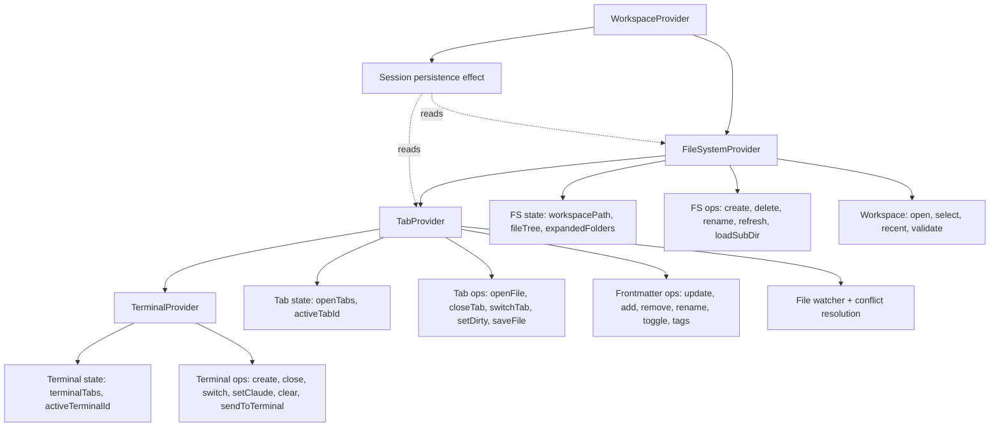

# Architecture Restructure and TypeScript Migration

## Overview

Restructure the codebase into a maintainable architecture: split the WorkspaceContext god object into focused domain contexts, reorganize components into logical directories, move extension-specific logic into extensions, eliminate `window.__quipu*` globals, and convert the entire codebase to TypeScript.

## Problem Frame

The codebase has grown organically to ~15 components, 10 services, and 7 extensions. Pain points:

1. **WorkspaceContext** (1029 lines, 49 exports) mixes tab management, terminal state, frontmatter operations, file watching, session persistence, and file CRUD into a single provider. Understanding any one domain requires reading the entire file.
2. **Components are flat** — 16 components in one directory with no grouping between editor-specific components (Editor, FindBar, FrontmatterProperties) and general UI (TabBar, ActivityBar, Toast).
3. **Extension-specific logic leaks into the shell** — `App.jsx` contains notebook kernel commands, `resolveViewer()` checks for save behavior, and `window.__quipu*` globals for cross-component communication. `WorkspaceContext` checks `isCodeFile()`, `isMermaidFile()`, `isNotebookFile()` instead of delegating to the registry.
4. **TipTap plugins mixed with viewer extensions** — `BlockDragHandle.js`, `RevealMarkdown.js`, `FindReplace.js`, `WikiLink.js` live alongside viewer extensions in `src/extensions/` despite being completely different abstractions.
5. **No TypeScript** — zero `.ts`/`.tsx` files despite `@types/react` already in devDependencies. No type safety for the complex state shapes, service adapters, or extension contracts.

## Requirements Trace

- R1. Split WorkspaceContext into focused, domain-scoped contexts
- R2. Reorganize `src/components/` into `editor/` and `ui/` subdirectories
- R3. Move extension-specific commands/keybindings into extension descriptors
- R4. Eliminate all `window.__quipu*` globals with proper React patterns
- R5. Separate TipTap editor plugins from viewer extensions in the directory structure
- R6. Convert all `.js`/`.jsx` source files to `.ts`/`.tsx`
- R7. Maintain both Electron and browser runtime support throughout
- R8. No regressions — all existing functionality must continue working
- R9. Replace hand-rolled UI components with shadcn/ui equivalents where they reduce boilerplate (Toast, ContextMenu, MenuBar, QuickOpen, FolderPicker)

## Scope Boundaries

- This plan does NOT address bug fixes (frame comments, PDF highlights, theme persistence, etc.) — those belong in the separate Bug Fixes & UX plan
- No new features are added
- Electron `main.cjs` and `preload.cjs` stay as CommonJS (Electron constraint) but get `.d.ts` type declarations
- Go server (`server/main.go`) is not touched
- No state library migration (no Redux/Zustand) — just splitting the existing useState/useCallback pattern into multiple contexts

## Context & Research

### Relevant Code and Patterns

- `src/context/WorkspaceContext.jsx` — 1029 lines, 13 useState, 49 context values
- `src/App.jsx` — imports all 16 components, contains extension-aware save/snapshot logic
- `src/extensions/registry.js` — simple array registry with `registerExtension()` / `resolveViewer()`
- `src/extensions/index.js` — side-effect import that registers all viewer extensions
- `src/services/` — 10 service files, each exports a dual-runtime adapter object
- `src/utils/fileTypes.js` — file type detection functions consumed by both WorkspaceContext and extensions
- `window.__quipuTerminalRef`, `__quipuEditorRawMode`, `__quipuToggleEditorMode`, `__quipuToggleFind`, `__quipuXtermInstance` — 5+ global bridges, plus `window.dispatchEvent(new CustomEvent('quipu:kernel-command'))` DOM event bridge for notebook kernel commands

### Institutional Learnings

- **useCallback TDZ bug** (`docs/solutions/runtime-errors/usecallback-temporal-dead-zone-in-dependency-array.md`): When splitting WorkspaceContext, hooks MUST be ordered by dependency DAG — state first, leaf callbacks second, dependent callbacks third, effects last. ESLint `exhaustive-deps` does NOT catch TDZ errors.
- **Context boundary rule** (`docs/solutions/feature-implementations/diff-viewer-state-lifting-to-main-editor.md`): `App.jsx` state is for ephemeral UI chrome; WorkspaceContext state is for persistent workspace data. Maintain this boundary during the split.
- **FRAME sync architecture** (`docs/solutions/integration-issues/frame-system-multi-component-sync.md`): Comment persistence uses shared UUIDs between TipTap marks and sidecar JSON files. Refactoring must preserve this bidirectional sync.
- **False dirty state** (`docs/solutions/ui-bugs/false-dirty-state-on-file-open.md`): Always use `setContent(content, { emitUpdate: false })` for programmatic loads. Must survive the context split.

## Key Technical Decisions

- **Multiple React contexts over a state library**: The existing useState/useCallback pattern works. The problem is co-location, not the pattern itself. Splitting into 3 focused contexts (Tab, Terminal, FileSystem) keeps the mental model simple and avoids a library migration.
- **No separate CommandContext — globals replaced through split contexts and the extension registry**: The 5 `window.__quipu*` globals are essentially cross-component callbacks. They are replaced by exposing the relevant functions through the appropriate context (e.g., TerminalContext exposes `sendToTerminal` and `clearTerminal`; TabContext or Editor props expose `toggleFind` and `toggleRawMode`). Extension commands (notebook kernel) are added to the extension registry as a `commands` field — no generic command bus needed for 5 consumers.
- **TypeScript strict mode with pragmatic TipTap exception**: `tsconfig.json` with `strict: true`. Each converted file must be fully typed — no `any` escape hatches except for (a) third-party libraries without types, and (b) ProseMirror plugin internals in `src/components/editor/extensions/` where TipTap's type definitions are incomplete for decoration sets, plugin state, and node spec attributes.
- **Bottom-up conversion order**: Convert leaf modules first (services, utils, types), then contexts, then components. Each layer consumes typed imports from below.
- **Extension descriptor enrichment over App.jsx branching**: Instead of `App.jsx` checking `resolveViewer()` to decide save behavior, each extension descriptor declares `onSave`, `onSnapshot`, and `commands`. The registry dispatches.
- **Nesting order: FileSystemProvider > TabProvider > TerminalProvider**: `saveFile` is 90% tab-state logic with a single `fs.writeFile` call — it belongs in TabContext, which consumes `workspacePath` from FileSystemContext above it. File watcher lives in TabContext too (it needs to read/mutate tab state for conflict detection, using `workspacePath` from FileSystemContext). This avoids circular dependencies.
- **Session persistence effect lives in WorkspaceProvider**: The debounced persistence effect at WorkspaceContext line 940 observes `openTabs`, `activeTabId` (TabContext), `expandedFolders`, and `workspacePath` (FileSystemContext). It cannot live in either sub-context alone. WorkspaceProvider, as the composer, can call both `useTab()` and `useFileSystem()` and run the single debounced effect.

## Open Questions

### Resolved During Planning

- **Should we use `useReducer` for the split contexts?** No. The current useState pattern is well-understood in this codebase and the learnings docs reference it. Reducers add indirection without solving the actual problem (co-location). Individual contexts are small enough that useState remains clear.
- **Should TipTap plugins move to `src/editor/extensions/` or `src/extensions/tiptap/`?** `src/components/editor/extensions/` — they are consumed exclusively by the Editor component and are conceptually part of the editor subsystem, not the viewer extension system.
- **Where does `saveFile` live after the split?** In TabContext. It is 90% tab-state logic (reads `activeTab`, `recentSavesRef`, mutates `openTabs`). It calls `fs.writeFile` at the end but does not need to live in FileSystemContext for that. TabContext consumes `workspacePath` from FileSystemContext.
- **Where does the file watcher live?** In TabContext. The watcher must read and mutate tab state (find matching tabs, compare content, set `hasConflict`). It receives `workspacePath` from FileSystemContext. This keeps the data flow unidirectional: FileSystem provides workspace path → Tab uses it for operations.
- **Where does session persistence live?** In WorkspaceProvider (the composer). It observes values from both TabContext and FileSystemContext, so it must live at the composition layer. A single debounced effect prevents double-writes.
- **What about shadcn/ui directory conflict?** shadcn primitives stay at `src/components/ui/` with their lowercase naming convention (`button.tsx`, `input.tsx`). Application UI components move into the same directory with PascalCase naming (`ActivityBar.tsx`, `MenuBar.tsx`). The two coexist — the naming convention makes them visually distinct.
- **Do we need a CommandContext for window globals?** No. The 5 globals are just cross-component callbacks. TerminalContext exposes terminal operations directly. Editor exposes `toggleFind` and `toggleRawMode` via props or the extension registry. The notebook `CustomEvent('quipu:kernel-command')` bridge moves into the notebook extension descriptor's `commands` field. A generic command bus is premature for this small number of consumers.

### Deferred to Implementation

- **Exact TypeScript types for TipTap editor extensions**: The type shapes for `BlockDragHandle`, `RevealMarkdown`, etc. depend on TipTap's extension API types. ProseMirror plugin internals (decoration sets, node spec attributes) may require `any` casts where TipTap's types are incomplete.
- **Whether `openTabsRef` stale-closure workaround survives the context split**: Since the file watcher now lives in TabContext alongside `openTabs`, the ref may no longer be needed. The implementer should evaluate.
- **Exact mechanism for `selectFolder` -> `restoreSession`**: Both live in different contexts after the split (`selectFolder` in FileSystemContext, `restoreSession` in TabContext). The implementer needs to decide: (a) `selectFolder` calls a callback provided by TabContext, or (b) TabContext watches `workspacePath` changes and auto-restores. Option (b) is simpler.

## High-Level Technical Design

> *This illustrates the intended approach and is directional guidance for review, not implementation specification. The implementing agent should treat it as context, not code to reproduce.*

### Context Split Architecture



**Data flow direction:** FileSystemContext provides `workspacePath` → TabContext consumes it for file operations and file watching → TerminalContext is self-contained. WorkspaceProvider observes both Tab and FileSystem for session persistence.

**Global replacement mapping:**
| Global | Replaced by |
|--------|------------|
| `window.__quipuTerminalRef` | TerminalContext exposes `sendToTerminal()`, `clearTerminal()`, `getSelection()`, `paste()` |
| `window.__quipuXtermInstance` | TerminalContext exposes `clearTerminal()` |
| `window.__quipuEditorRawMode` | Editor internal state, exposed via props to App |
| `window.__quipuToggleEditorMode` | Editor prop callback |
| `window.__quipuToggleFind` | Editor prop callback |
| `CustomEvent('quipu:kernel-command')` | Notebook extension descriptor `commands` field |

### Directory Structure After Refactoring

```
src/
  components/
    editor/           # Editor-specific components
      Editor.tsx
      FindBar.tsx
      FrontmatterProperties.tsx
      index.ts
      extensions/      # TipTap plugins (moved from src/extensions/)
        BlockDragHandle.ts
        RevealMarkdown.ts
        FindReplace.ts
        WikiLink.ts
        CodeBlockWithLang.tsx
    ui/               # General UI + shadcn primitives (coexist by naming convention)
      ActivityBar.tsx       # PascalCase = application components
      ContextMenu.tsx
      FileConflictBar.tsx
      FileExplorer.tsx
      FolderPicker.tsx
      MenuBar.tsx
      QuickOpen.tsx
      SearchPanel.tsx
      SourceControlPanel.tsx
      TabBar.tsx
      Terminal.tsx
      TitleBar.tsx
      Toast.tsx
      index.ts
      button.tsx            # lowercase = shadcn primitives (already here)
      input.tsx
      badge.tsx
      collapsible.tsx
  context/
    TabContext.tsx
    TerminalContext.tsx
    FileSystemContext.tsx
    WorkspaceProvider.tsx   # Composes all contexts + session persistence
  extensions/              # Viewer extensions only
    registry.ts
    index.ts
    types.ts               # ExtensionDescriptor interface
    pdf-viewer/
    code-viewer/
    notebook/
    mermaid-viewer/
    media-viewer/
    excalidraw-viewer/
    diff-viewer/
  services/                # Dual-runtime adapters
    fileSystem.ts
    fileWatcher.ts
    frameService.ts
    gitService.ts
    kernelService.ts
    searchService.ts
    storageService.ts
    terminalService.ts
    claudeInstaller.ts
  utils/
    fileTypes.ts
  types/                   # Shared type definitions
    tab.ts
    workspace.ts
    editor.ts
    extensions.ts
  lib/
    utils.ts
  App.tsx
```

### Extension Descriptor Enhancement

```
Current:  { id, canHandle, priority, component }
Enhanced: { id, canHandle, priority, component, commands?, onSave?, onSnapshot? }
```

This lets `App.tsx` delegate save/snapshot behavior to the extension registry instead of branching on `resolveViewer() !== null`.

## Implementation Units

### Phase 1: Foundation (TypeScript setup + types)

- [ ] **Unit 1: TypeScript configuration and shared type definitions**

  **Goal:** Establish TypeScript infrastructure and define the core type shapes that all subsequent units will import.

  **Requirements:** R6, R8

  **Dependencies:** None

  **Files:**
  - Create: `tsconfig.json`
  - Create: `src/types/tab.ts`
  - Create: `src/types/workspace.ts`
  - Create: `src/types/editor.ts`
  - Create: `src/types/extensions.ts`
  - Modify: `vite.config.js` -> `vite.config.ts`
  - Modify: `package.json` (add typescript devDependency if missing)

  **Approach:**
  - `tsconfig.json` with `strict: true`, `jsx: "react-jsx"`, path alias `@/*` -> `src/*`
  - Type definitions extracted from the shapes already implicit in WorkspaceContext: `Tab`, `FileTreeEntry`, `TerminalTab`, `Frontmatter`, `Workspace` types
  - `ExtensionDescriptor` interface with optional `commands`, `onSave`, `onSnapshot` fields
  - Vite handles `.ts`/`.tsx` natively — no additional plugin needed

  **Patterns to follow:**
  - `@types/react` already in devDependencies
  - `@/` path alias in `vite.config.js`

  **Test scenarios:**
  - Happy path: `npm run dev` starts successfully with the new tsconfig
  - Happy path: `npm run build` completes without errors
  - Edge case: Existing `.jsx` files continue to work alongside new `.ts` files (mixed mode)

  **Verification:**
  - `npx tsc --noEmit` passes
  - Dev server starts and loads the app

- [ ] **Unit 2: Convert services and utils to TypeScript**

  **Goal:** Convert the leaf layer (services, utils) to TypeScript with proper types for the dual-runtime adapter pattern.

  **Requirements:** R6, R7

  **Dependencies:** Unit 1

  **Files:**
  - Modify: `src/services/fileSystem.js` -> `.ts`
  - Modify: `src/services/fileWatcher.js` -> `.ts`
  - Modify: `src/services/frameService.js` -> `.ts`
  - Modify: `src/services/gitService.js` -> `.ts`
  - Modify: `src/services/kernelService.js` -> `.ts`
  - Modify: `src/services/searchService.js` -> `.ts`
  - Modify: `src/services/storageService.js` -> `.ts`
  - Modify: `src/services/terminalService.js` -> `.ts`
  - Modify: `src/services/claudeInstaller.js` -> `.ts`
  - Modify: `src/utils/fileTypes.js` -> `.ts`
  - Modify: `src/lib/utils.js` -> `.ts`
  - Test: `src/utils/fileTypes.test.ts` (rename existing test)

  **Approach:**
  - Each service exports a typed interface (e.g., `FileSystemService`) and a default implementation object satisfying it
  - The `isElectron()` conditional pattern stays — just add types to both branches
  - `fileTypes.ts` functions get explicit return types and parameter types

  **Patterns to follow:**
  - Existing adapter pattern in `src/services/fileSystem.js` (conditional export based on runtime)

  **Test scenarios:**
  - Happy path: `fileTypes.test.ts` passes after rename with no logic changes
  - Happy path: File read/write operations work in browser mode (Go server)
  - Integration: Electron IPC calls still type-check against the preload bridge (verified by `tsc --noEmit`)

  **Verification:**
  - All existing tests pass
  - `tsc --noEmit` passes
  - App loads and can open/save files in both runtimes

### Phase 2: Context Split

- [ ] **Unit 3: Extract TerminalContext**

  **Goal:** Move terminal tab state and operations into a dedicated context. Also replace `window.__quipuTerminalRef` and `window.__quipuXtermInstance` by exposing terminal operations directly through the context.

  **Requirements:** R1, R4

  **Dependencies:** Unit 1

  **Files:**
  - Create: `src/context/TerminalContext.tsx`
  - Modify: `src/context/WorkspaceContext.jsx` (remove ~60 lines of terminal state/ops)
  - Modify: `src/App.jsx` (import from TerminalContext, remove `window.__quipuTerminalRef` setup)
  - Modify: `src/components/Terminal.jsx` (update context import, remove `window.__quipuXtermInstance` — expose via context instead)
  - Test: `src/context/TerminalContext.test.tsx`

  **Approach:**
  - Move: `terminalTabs`, `activeTerminalId`, `terminalCounterRef`, `createTerminalTab`, `closeTerminalTab`, `switchTerminalTab`, `setTerminalClaudeRunning`, `clearAllTerminals`
  - Add: `sendToTerminal(text)`, `clearTerminal()`, `getTerminalSelection()`, `pasteToTerminal(text)` — these replace the `window.__quipuTerminalRef` and `window.__quipuXtermInstance` globals. Terminal.tsx registers the xterm instance ref with the context on mount; the context exposes the operations.
  - Self-contained — no dependencies on other workspace state
  - Fully typed from creation: `TerminalContextValue` interface, typed `useTerminal()` hook

  **Patterns to follow:**
  - Existing WorkspaceContext provider/hook pattern

  **Test scenarios:**
  - Happy path: Create terminal tab -> appears in list, becomes active
  - Happy path: Close terminal tab -> removed, adjacent tab becomes active
  - Happy path: `sendToTerminal("ls")` writes to the active terminal
  - Happy path: `clearTerminal()` clears the active terminal output
  - Edge case: Create 6th terminal -> toast warning, no new tab (MAX_TERMINALS = 5)
  - Edge case: Close last terminal -> activeTerminalId is null
  - Edge case: `sendToTerminal` when no terminal exists -> no-op, no crash
  - Edge case: `getTerminalSelection()` returns selection text or empty string (synchronous query)

  **Verification:**
  - Terminal creation/switching/closing works
  - Claude running indicator still updates correctly
  - `window.__quipuTerminalRef` and `window.__quipuXtermInstance` removed from codebase
  - Context menu "Clear Terminal" and clipboard operations work through TerminalContext

- [ ] **Unit 4: Extract FileSystemContext**

  **Goal:** Move file system state (workspacePath, fileTree, expandedFolders, file CRUD, workspace management) into FileSystemContext.

  **Requirements:** R1

  **Dependencies:** Unit 1, Unit 2 (typed services)

  **Files:**
  - Create: `src/context/FileSystemContext.tsx`
  - Modify: `src/context/WorkspaceContext.jsx` (remove ~300 lines of filesystem/workspace logic)
  - Modify: `src/components/FileExplorer.jsx` (update context import for file operations)
  - Test: `src/context/FileSystemContext.test.tsx`

  **Approach:**
  - Move state: `workspacePath`, `fileTree`, `expandedFolders`, `showFolderPicker`, `recentWorkspaces`, `gitChangeCount`, `directoryVersion`, `updateGitChangeCount`
  - Move operations: `openFolder`, `cancelFolderPicker`, `createNewFile`, `createNewFolder`, `deleteEntry`, `renameEntry`, `refreshDirectory`, `loadSubDirectory`, `updateRecentWorkspaces`, `clearRecentWorkspaces`, `removeFromRecentWorkspaces`, `validateAndPruneWorkspaces`, `revealFolder`
  - Move `selectFolder` — but note it currently calls `restoreSession()`. After the split, TabContext will watch `workspacePath` changes and auto-restore session (see Unit 5 deferred question). For now, `selectFolder` just sets `workspacePath` and loads the file tree.
  - Fully typed from creation: `FileSystemContextValue` interface, typed `useFileSystem()` hook
  - Maintain hook dependency-DAG ordering per TDZ learnings

  **Patterns to follow:**
  - Existing WorkspaceContext provider/hook pattern

  **Test scenarios:**
  - Happy path: Open folder -> fileTree populates, workspacePath is set
  - Happy path: Create file/folder -> appears in file tree, directoryVersion increments
  - Happy path: Delete entry -> removed from file tree
  - Happy path: Rename entry -> reflected in file tree
  - Edge case: Open folder with invalid path -> toast error, state unchanged
  - Edge case: Recent workspaces list persists across page reloads via storageService

  **Verification:**
  - WorkspaceContext is ~300 lines smaller
  - All file tree operations work
  - Workspace selection/switching works

- [ ] **Unit 5: Extract TabContext and compose WorkspaceProvider**

  **Goal:** Move tab state and operations (openTabs, activeTabId, tab CRUD, frontmatter ops, saveFile, file watcher, session restore) into TabContext. Replace remaining `window.__quipu*` editor globals. Create WorkspaceProvider as the thin composition wrapper with the session persistence effect.

  **Requirements:** R1, R4

  **Dependencies:** Unit 3, Unit 4

  **Files:**
  - Create: `src/context/TabContext.tsx`
  - Modify: `src/context/WorkspaceContext.jsx` -> rename to `src/context/WorkspaceProvider.tsx` (becomes thin composer)
  - Modify: `src/App.jsx` (import from TabContext for tab ops, pass editor callbacks as props instead of globals)
  - Modify: `src/components/Editor.jsx` (remove `window.__quipuEditorRawMode`, `__quipuToggleEditorMode`, `__quipuToggleFind` — expose via props/callbacks)
  - Modify: `src/components/TabBar.jsx` (update context import)
  - Modify: `src/components/FileExplorer.jsx` (update context import for openFile)
  - Modify: `src/components/MenuBar.jsx` (use context operations instead of globals)
  - Test: `src/context/TabContext.test.tsx`

  **Approach:**
  - Move state: `openTabs`, `activeTabId`, `openTabsRef`, `recentSavesRef`
  - Move operations: `openFile`, `closeTab`, `switchTab`, `setTabDirty`, `updateTabContent`, `snapshotTab`, `reloadTabFromDisk`, all frontmatter operations, `saveFile`
  - Move: File watcher effects (WorkspaceContext lines 820-897) and conflict resolution (`resolveConflictReload`, `resolveConflictKeep`, `resolveConflictDismiss`) — these read/mutate tab state and need `workspacePath` from FileSystemContext
  - TabContext consumes `useFileSystem()` internally for `workspacePath`
  - Session restore: TabContext watches `workspacePath` changes via `useEffect` and auto-restores the session for that workspace. This replaces the `selectFolder -> restoreSession` cross-context call.
  - `window.__quipuEditorRawMode`, `__quipuToggleEditorMode`, `__quipuToggleFind` replaced by: Editor accepts callback props from App.jsx (`onToggleRawMode`, `onToggleFind`); App.jsx holds a ref to these callbacks. This is simpler than a command bus for 3 functions.
  - WorkspaceProvider composition:
    ```
    <FileSystemProvider>
      <TabProvider>
        <TerminalProvider>
          {children}
        </TerminalProvider>
      </TabProvider>
    </FileSystemProvider>
    ```
  - WorkspaceProvider runs the debounced session persistence effect, consuming both `useTab()` and `useFileSystem()`
  - Export `useWorkspace()` backward-compat hook that composes all sub-hooks. Note: this hook subscribes to ALL contexts, so components using it get no performance benefit from the split. It exists purely for migration convenience.
  - Fully typed from creation: `TabContextValue` interface, typed `useTab()` hook

  **Execution note:** Add characterization coverage for tab open/close/switch and file watcher conflict detection before extracting, to catch regressions from the move.

  **Patterns to follow:**
  - Existing WorkspaceContext provider/hook pattern
  - `openFile` function structure at WorkspaceContext line 528

  **Test scenarios:**
  - Happy path: Open a file -> tab appears, content loads, tab becomes active
  - Happy path: Close a tab -> removed from openTabs, adjacent tab becomes active
  - Happy path: Switch tabs -> activeTabId updates, content displayed
  - Happy path: Save file -> content written to disk, tab marked clean
  - Happy path: Session restore -> when workspacePath changes, previously open tabs for that workspace reappear
  - Edge case: Open same file twice -> switches to existing tab (no duplicate)
  - Edge case: Open 13th file -> toast warning, no new tab (MAX_TABS = 12)
  - Edge case: Close last tab -> activeTabId is null, empty state shown
  - Edge case: File changed externally -> conflict bar appears with reload/keep/dismiss
  - Edge case: File changed externally while tab is dirty -> conflict shown (not auto-reloaded)
  - Edge case: File changed externally while tab is clean -> silent reload
  - Integration: Frontmatter update -> tab marked dirty, frontmatter reflected in editor
  - Integration: Session persistence debounces across tab changes and workspace changes (single write)
  - Integration: `useWorkspace()` backward-compat hook returns all values from all sub-contexts

  **Verification:**
  - Original WorkspaceContext file is replaced by thin WorkspaceProvider
  - All tab, save, and file watcher operations work identically to before
  - All `window.__quipu*` globals eliminated: `grep -r "window.__quipu" src/` returns zero results
  - `CustomEvent('quipu:kernel-command')` still works (deferred to Unit 7 for extension descriptor migration)
  - Session persistence saves and restores across page reloads

### Phase 3: Component Reorganization, TypeScript Conversion, and Extension Ownership

- [ ] **Unit 6: Reorganize components into editor/ and ui/ directories with full TypeScript conversion and shadcn replacements**

  **Goal:** Move components into logical subdirectories, move TipTap plugins into the editor subtree, convert all components to TypeScript, and replace 5 hand-rolled UI components with shadcn/ui equivalents — all in a single pass to avoid double-touching files.

  **Requirements:** R2, R5, R6, R9

  **Dependencies:** Unit 5 (contexts are split, imports are already changing)

  **Files:**
  - Move + convert: `src/components/Editor.jsx` -> `src/components/editor/Editor.tsx`
  - Move + convert: `src/components/FindBar.jsx` -> `src/components/editor/FindBar.tsx`
  - Move + convert: `src/components/FrontmatterProperties.jsx` -> `src/components/editor/FrontmatterProperties.tsx`
  - Move + convert: `src/extensions/BlockDragHandle.js` -> `src/components/editor/extensions/BlockDragHandle.ts`
  - Move + convert: `src/extensions/RevealMarkdown.js` -> `src/components/editor/extensions/RevealMarkdown.ts`
  - Move + convert: `src/extensions/FindReplace.js` -> `src/components/editor/extensions/FindReplace.ts`
  - Move + convert: `src/extensions/WikiLink.js` -> `src/components/editor/extensions/WikiLink.ts`
  - Move + convert: `src/extensions/CodeBlockWithLang.jsx` -> `src/components/editor/extensions/CodeBlockWithLang.tsx`
  - Move + convert: `src/components/ActivityBar.jsx` -> `src/components/ui/ActivityBar.tsx`
  - Move + convert: `src/components/FileConflictBar.jsx` -> `src/components/ui/FileConflictBar.tsx`
  - Move + convert: `src/components/FileExplorer.jsx` -> `src/components/ui/FileExplorer.tsx`
  - Move + convert: `src/components/SearchPanel.jsx` -> `src/components/ui/SearchPanel.tsx`
  - Move + convert: `src/components/SourceControlPanel.jsx` -> `src/components/ui/SourceControlPanel.tsx`
  - Move + convert: `src/components/TabBar.jsx` -> `src/components/ui/TabBar.tsx`
  - Move + convert: `src/components/Terminal.jsx` -> `src/components/ui/Terminal.tsx`
  - Move + convert: `src/components/TitleBar.jsx` -> `src/components/ui/TitleBar.tsx`
  - Move + convert: `src/App.jsx` -> `src/App.tsx`
  - Move + convert: `src/components/Terminal.test.jsx` -> `src/components/ui/Terminal.test.tsx`
  - Rewrite with shadcn: `src/components/Toast.jsx` -> `src/components/ui/Toast.tsx` (replace with `sonner`)
  - Rewrite with shadcn: `src/components/ContextMenu.jsx` -> `src/components/ui/ContextMenu.tsx` (replace with shadcn `context-menu`)
  - Rewrite with shadcn: `src/components/MenuBar.jsx` -> `src/components/ui/MenuBar.tsx` (replace with shadcn `menubar`)
  - Rewrite with shadcn: `src/components/QuickOpen.jsx` -> `src/components/ui/QuickOpen.tsx` (replace with shadcn `command` / cmdk)
  - Rewrite with shadcn: `src/components/FolderPicker.jsx` -> `src/components/ui/FolderPicker.tsx` (replace modal with shadcn `dialog`)
  - Install: shadcn `context-menu`, `menubar`, `command`, `dialog` primitives + `sonner`
  - Convert: All extension viewer components in `src/extensions/*/` (`.jsx` -> `.tsx`)
  - Create: `src/components/editor/index.ts` (barrel export)
  - Create: `src/components/ui/index.ts` (barrel export)

  **Approach:**
  - Move and rename `.jsx` -> `.tsx` / `.js` -> `.ts` simultaneously
  - Add props interfaces for each component (e.g., `interface EditorProps { ... }`)
  - Event handler types from React's type definitions
  - TipTap editor instance typed as `Editor` from `@tiptap/react`
  - TipTap plugin internals in `src/components/editor/extensions/` may use `any` for ProseMirror decoration sets, plugin state, and node spec attributes where TipTap's types are incomplete
  - shadcn primitives stay in `src/components/ui/` unchanged (already lowercase `.tsx`)
  - Update all import paths throughout the codebase
  - **shadcn replacements** (5 components, ~300 lines of boilerplate removed):
    - **Toast** -> `sonner`: Delete custom `ToastProvider`, timer management, and toast rendering. Replace with `<Toaster />` from sonner and `toast.error()` / `toast.success()` / `toast.info()` / `toast.warning()` calls. The `useToast()` hook can be kept as a thin wrapper (`showToast(msg, type)` -> `toast[type](msg)`) for backward compatibility, or callers can migrate to sonner directly. Style the toaster with theme tokens to match current appearance (colored left stripe, dark bg).
    - **ContextMenu** -> shadcn `context-menu`: Replace hand-rolled viewport clamping, click-outside, and Escape handling with Radix ContextMenu. Keep the same items data shape but render declaratively with `<ContextMenuItem>`. Gains keyboard navigation and focus trap for free. Style with theme tokens.
    - **MenuBar** -> shadcn `menubar`: Replace current manual submenu rendering with Radix Menubar. Gains hover-to-switch between top-level menus and built-in keyboard navigation. Preserve existing menu structure (File, Edit, View, etc.) and shortcut labels.
    - **QuickOpen** -> shadcn `command` (cmdk): Replace hand-rolled keyboard navigation, filtering, and scroll-into-view with cmdk. Keep the dual-mode logic (file mode vs `>` command mode) — cmdk supports grouping natively. The file fetching and command data stays; only the input/list/selection boilerplate is replaced.
    - **FolderPicker** -> shadcn `dialog`: Wrap existing folder picker content in shadcn Dialog for consistent modal behavior (overlay, close on Escape, focus trap). Internal content stays the same.

  **Execution note:** Execution target: external-delegate. This is a large unit — move files, add type annotations, update imports, replace 5 components. Can be split across multiple sessions. Recommended order: (1) install shadcn deps, (2) move + convert non-shadcn components, (3) rewrite shadcn components.

  **Patterns to follow:**
  - shadcn/ui files are already in `src/components/ui/` with lowercase names
  - React function components with typed props
  - Existing component signatures give the implicit prop shapes
  - Existing shadcn usage in `FrontmatterProperties.jsx` (Button, Input, Badge, Collapsible) and `FileConflictBar.jsx` (Button)

  **Test scenarios:**
  - Happy path: App loads with all components rendering correctly after move
  - Happy path: Editor opens with all TipTap extensions functional (block drag, reveal markdown, find/replace, wiki links, code blocks)
  - Happy path: `tsc --noEmit` passes for all component files
  - Happy path: Toast notifications appear with correct type styling (error=red, warning=yellow, success=green, info=blue)
  - Happy path: Right-click context menu opens at cursor position with correct items, closes on click outside or Escape
  - Happy path: MenuBar File/Edit/View menus open on click, hover-switch between menus works
  - Happy path: QuickOpen (Ctrl+P) opens, filters files as user types, `>` prefix switches to command mode
  - Happy path: FolderPicker dialog opens centered, closes on Escape, folder selection works
  - Edge case: Vite hot reload works with the new directory structure
  - Edge case: TipTap extensions compile (allowing `any` for ProseMirror internals only)
  - Edge case: Context menu clamps to viewport when triggered near screen edge (Radix handles this natively)
  - Edge case: Toast auto-dismisses after timeout, max 5 visible

  **Verification:**
  - `src/components/` has `editor/`, `ui/` subdirectories
  - No loose component files remain directly in `src/components/`
  - `src/extensions/` contains only viewer extensions and the registry
  - All TipTap extensions are under `src/components/editor/extensions/`
  - Zero `.jsx` or `.js` files remain in `src/` (except `src/test/setup.js`)
  - `tsc --noEmit` passes with zero errors
  - No hand-rolled click-outside, viewport clamping, or keyboard navigation in Toast, ContextMenu, MenuBar, QuickOpen, or FolderPicker
  - Full app functionality works — all 5 replaced components behave identically to before

- [ ] **Unit 7: Move extension-specific logic into extension descriptors**

  **Goal:** Enrich the extension descriptor interface so that save behavior, snapshot behavior, and commands live in extensions — not in App.tsx or WorkspaceProvider. Also migrate the `CustomEvent('quipu:kernel-command')` bridge into the extension system.

  **Requirements:** R3

  **Dependencies:** Unit 5 (contexts split), Unit 6 (directory reorg + TS)

  **Files:**
  - Modify: `src/extensions/registry.ts` (enhanced descriptor interface, add `getExtensionForTab()` and `getCommandsForTab()`)
  - Modify: `src/extensions/types.ts` (add `onSave`, `onSnapshot`, `commands` to ExtensionDescriptor)
  - Modify: `src/extensions/notebook/index.ts` (add kernel commands to descriptor: `kernel.runAll`, `kernel.interrupt`, `kernel.restart`)
  - Modify: `src/extensions/notebook/NotebookViewer.tsx` (remove `CustomEvent` listener, receive commands via props or descriptor)
  - Modify: `src/extensions/code-viewer/index.ts` (add save behavior)
  - Modify: `src/App.tsx` (remove `resolveViewer()` branching in save logic, delegate to registry; remove `CustomEvent` dispatch for kernel commands)
  - Modify: `src/components/ui/MenuBar.tsx` (remove hardcoded kernel dispatch, invoke commands through extension registry)
  - Test: `src/extensions/registry.test.ts`

  **Approach:**
  - `ExtensionDescriptor` gains optional fields:
    - `onSave?(tab, editorInstance): Promise<string | null>` — returns content to save, or null for default behavior
    - `onSnapshot?(tab, editorInstance): any` — returns snapshot data for the tab
    - `commands?: Array<{ id: string, label: string, handler: (...args: unknown[]) => void }>` — commands this extension contributes
  - `registry.ts` adds `getExtensionForTab(tab)` and `getCommandsForTab(tab)` helpers
  - Notebook extension declares `kernel.runAll`, `kernel.interrupt`, `kernel.restart` commands in its descriptor instead of relying on `CustomEvent`
  - `App.tsx` save logic becomes: `const ext = getExtensionForTab(activeTab); if (ext?.onSave) await ext.onSave(tab, editor); else defaultSave(tab, editor);`
  - Remove `isCodeFile()`, `isMermaidFile()`, `isNotebookFile()` checks from App/context — the registry is the single source of truth

  **Patterns to follow:**
  - Existing `registerExtension()` / `resolveViewer()` pattern in `src/extensions/registry.ts`
  - Extension registration side-effect in `src/extensions/index.ts`

  **Test scenarios:**
  - Happy path: Save a markdown file -> default save path works (no extension match)
  - Happy path: Save a code file -> CodeViewer extension's onSave handles it
  - Happy path: Notebook kernel commands accessible from menu -> dispatched via extension descriptor, not CustomEvent
  - Edge case: Extension with no onSave -> falls back to default save behavior
  - Edge case: Extension with no commands -> `getCommandsForTab()` returns empty array
  - Integration: Switching from editor to PDF tab -> snapshot dispatched via extension descriptor, not App.tsx conditional
  - Integration: `CustomEvent('quipu:kernel-command')` is fully removed from codebase

  **Verification:**
  - `App.tsx` has no direct `resolveViewer()` calls for save/snapshot branching
  - `grep -r "isCodeFile\|isMermaidFile\|isNotebookFile" src/context/ src/App.tsx` returns zero results
  - `grep -r "quipu:kernel-command" src/` returns zero results
  - Notebook kernel commands work from the menu
  - All file types save correctly

- [ ] **Unit 8: Final cleanup — Electron types, useWorkspace() removal, CLAUDE.md update**

  **Goal:** Add type declarations for Electron CommonJS files, migrate all components off `useWorkspace()` to specific context hooks, and update project documentation.

  **Requirements:** R6, R7, R8

  **Dependencies:** Unit 7

  **Files:**
  - Create: `electron/types.d.ts` (type declarations for main.cjs and preload.cjs contextBridge API)
  - Modify: `src/test/setup.js` -> `src/test/setup.ts`
  - Modify: `vite.config.ts` (update setupFiles path)
  - Modify: All components still using `useWorkspace()` -> switch to `useTab()`, `useFileSystem()`, `useTerminal()` as appropriate
  - Remove: `useWorkspace()` backward-compat hook from `src/context/WorkspaceProvider.tsx`
  - Modify: `CLAUDE.md` (update conventions to reflect TypeScript, new directory structure, new context hooks)

  **Approach:**
  - Electron `main.cjs` and `preload.cjs` stay as CJS but get companion type declarations describing the `contextBridge` API shape
  - Search all imports of `useWorkspace` and replace with the appropriate specific hook(s)
  - Remove the backward-compat `useWorkspace()` hook — it causes every consumer to re-render on any context change, negating the split's performance benefit
  - Update CLAUDE.md: `.tsx`/`.ts` file extensions, new directory structure, new context hooks (useTab, useFileSystem, useTerminal), removed window globals, extension descriptor pattern

  **Test scenarios:**
  - Happy path: `tsc --noEmit` passes including Electron type declarations
  - Happy path: `npm run build` succeeds
  - Happy path: `npm run start` launches Electron correctly
  - Happy path: `grep -r "useWorkspace" src/` returns zero results (except WorkspaceProvider export removal)
  - Integration: All components work with specific context hooks

  **Verification:**
  - `tsc --noEmit` passes with zero errors
  - Zero `.jsx` or `.js` files remain in `src/`
  - `useWorkspace()` is fully removed
  - CLAUDE.md accurately reflects the new architecture
  - `npm run build` and `npm run start` work
  - Full app functionality — no regressions

## System-Wide Impact

- **Interaction graph:** TabContext consumes `workspacePath` from FileSystemContext (parent in nesting order). TerminalContext is self-contained. File watcher lives in TabContext alongside the tab state it reads/mutates. WorkspaceProvider runs the session persistence effect spanning both Tab and FileSystem state. Extension descriptors declare their own save/snapshot/command behavior — App.tsx delegates through the registry.
- **Error propagation:** Toast errors continue flowing through `useToast()` which is independent of all workspace contexts. No change needed.
- **State lifecycle risks:** The session persistence effect in WorkspaceProvider must debounce across context changes — a tab change and a workspace path change should not trigger two separate persistence writes. Using a single effect in WorkspaceProvider with a debounce timer handles this.
- **API surface parity:** During migration, `useWorkspace()` provides backward compatibility. Unit 8 removes it once all consumers are migrated. The extension registry public API (`registerExtension`, `resolveViewer`) stays the same — it gains optional fields (`onSave`, `onSnapshot`, `commands`).
- **Unchanged invariants:** The dual-runtime service adapter pattern is preserved. The 4-place change requirement for new backend features remains. FRAME comment sync architecture is preserved.
- **Performance note:** The context split only improves render performance once components migrate from `useWorkspace()` to specific hooks. Until then, re-render behavior is identical to today.

## Risks & Dependencies

| Risk | Mitigation |
|------|------------|
| Context split introduces stale closure bugs | Follow TDZ learning: dependency-DAG ordering. Add characterization tests for tab/file operations before splitting. |
| `selectFolder` -> `restoreSession` cross-context call | TabContext watches `workspacePath` changes and auto-restores. No direct cross-context function call needed. |
| File watcher needs both tab state and workspacePath | File watcher lives in TabContext, consumes `workspacePath` from FileSystemContext via `useFileSystem()`. Unidirectional data flow. |
| Session persistence spans two contexts | Single debounced effect in WorkspaceProvider, consuming both `useTab()` and `useFileSystem()`. |
| TypeScript migration breaks build | Incremental conversion — each unit must pass `tsc --noEmit` and `npm run build` before proceeding. Mixed JS/TS is supported by Vite. |
| Large Editor.jsx (1384 lines) is hard to type | Type the props and hooks first. Allow `any` for ProseMirror plugin internals where TipTap's types are incomplete. Editor decomposition is out of scope. |
| Import path churn from component reorganization | Do the directory move (Unit 6) after contexts are split, so imports change once, not twice. Use barrel exports to minimize import paths. |
| `useWorkspace()` backward-compat hook negates performance benefit | Explicitly removed in Unit 8. Components migrate to specific hooks. |

## Sources & References

- Related code: `src/context/WorkspaceContext.jsx`, `src/App.jsx`, `src/extensions/registry.js`
- Institutional learnings: `docs/solutions/runtime-errors/usecallback-temporal-dead-zone-in-dependency-array.md`, `docs/solutions/runtime-errors/usecallback-temporal-dead-zone-in-useeffect.md`, `docs/solutions/feature-implementations/diff-viewer-state-lifting-to-main-editor.md`, `docs/solutions/integration-issues/frame-system-multi-component-sync.md`
