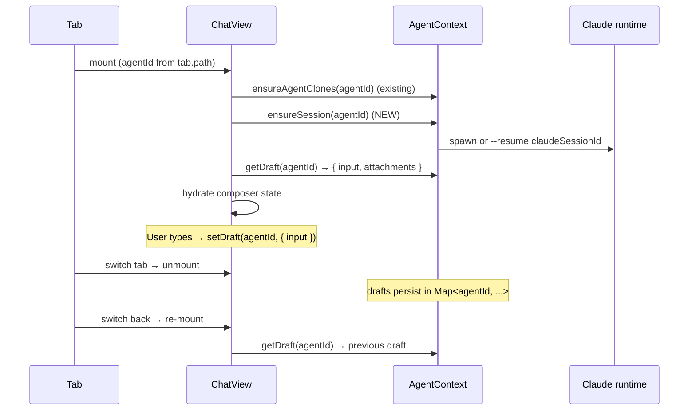

# Workspace-scoped agents/chats/repos + per-chat drafts + auto-resume + AskUserQuestion buttons

## Overview

Today's contexts (`AgentContext`, `RepoContext`, `FileSystemContext.recentWorkspaces`) all read from and write to **global** keys in the shared `quipu-state.json` file (Electron) / `localStorage` (browser). Two windows running side-by-side load the same arrays into independent React state, then race each other on every state change — last writer wins, the loser's agents/repos/folders silently disappear, and the recent-workspaces list collapses to whatever the most recent window wrote.

The fix: scope agents, chats, repos, sessions, folders, and the recent-workspaces list to the workspace they were created in. Storage keys move from `agents` → `agents:<workspacePath>`, etc. — the same pattern already used for `session:<workspacePath>`. Each window only touches its own workspace's keys, eliminating the cross-window race entirely.

Three smaller fixes ride along because they came up in the same conversation:

1. **Per-chat drafts** — `ChatView` keeps composer text in a single component-local `useState`, and the viewer is rendered without a `key` prop, so switching between two chat tabs leaks one chat's draft into another.
2. **Auto-resume on reopen** — `ensureSession` only fires from `sendMessage`. Reopening a chat tab leaves Claude disconnected until the user sends a new message; the user expects the session to come back automatically.
3. **AskUserQuestion buttons** — when an agent calls `AskUserQuestion`, Quipu currently renders the options as a passive `<ul>` and the user can only "Let agent answer" or "Cancel". Each option should be a clickable button that picks that answer.

## Problem Frame

Quipu is a multi-window Electron app, but its persistence layer assumes a single window. The Electron storage backend (`electron/main.cjs:68-83`) is one JSON file under `app.getPath('userData')`, and every renderer hits the same file via the `storage-get` / `storage-set` IPC channels. The renderer-side contexts (`AgentContext`, `RepoContext`, `FileSystemContext`) load global keys on mount, mirror them into React state, and write the entire mirrored array back on every state change. With one window this is fine — with two it is a textbook last-writer-wins data-loss bug.

The user's request is twofold:

- **Stop losing data** — when the user opens a second window, agents, chats, and repos created in the first window should not vanish, and the recent-workspaces list should not collapse.
- **Make the boundary explicit** — agents/chats/repos created inside workspace A should appear in workspace A only, not bleed into workspace B. This matches how session restore (open tabs / expanded folders) already behaves.

Three peripheral pain points came up alongside the workspace-scoping issue and are bundled here because they share files and code paths with the main change:

- The chat composer leaks drafts between chats.
- Reopening a chat tab does not reconnect the Claude subprocess.
- The AskUserQuestion rendering shows options as static labels instead of buttons.

## Requirements Trace

- **R1.** `agents`, `agent-sessions`, `agent-folders`, and `repos` persist per workspace. Items created in workspace A appear only in workspace A; items created in workspace B appear only in workspace B.
- **R2.** Opening a second window with a different workspace does not delete or hide data created in the first window. Both windows can run concurrently without race-induced data loss for these collections.
- **R3.** `recentWorkspaces` is per-window — each window maintains its own recent list and does not write to a shared key. (User chose "make per-window" over "keep global, fix the race".)
- **R4.** On first launch after this ships, existing global `agents` / `agent-sessions` / `agent-folders` / `repos` data migrates into whichever workspace the user opens first, then the global keys are cleared so the migration runs exactly once.
- **R5.** The change works in both runtimes — Electron (JSON-backed) and browser (`localStorage`-backed) — without runtime-specific branching at the call site.
- **R6.** ChatView's composer draft is per-chat. Switching tabs preserves the draft of the previous chat at its agent id, and entering a different chat shows that chat's own draft (or empty if none).
- **R7.** Reopening a chat tab automatically re-establishes the Claude subprocess (`--resume <claudeSessionId>` if a session id is stored, fresh start otherwise) without requiring the user to send a message first.
- **R8.** When the agent calls `AskUserQuestion`, each option renders as a clickable button. Clicking a button submits that option as the answer and resolves the permission request without forcing the user through the generic Allow/Deny path.

## Scope Boundaries

**In scope:**

- Workspace-scoped storage keys for `agents`, `agent-sessions`, `agent-folders`, `repos`.
- Per-window `recentWorkspaces` (rename to a window-local key path or move to in-memory + per-window storage).
- One-shot migration of existing global keys into the first opened workspace.
- Deferring `AgentProvider` / `RepoProvider` initial load until `workspacePath` is known, and re-loading on workspace switch.
- Per-chat draft state in `AgentContext` (in-memory, not persisted across restarts).
- Auto-`ensureSession` on `ChatView` mount when a `claudeSessionId` exists or the agent is fully configured.
- Clickable AskUserQuestion option buttons that round-trip the user's answer back through `respondToPermission`.
- Updating `WorkspaceContext.tsx` provider composition if needed to thread workspace path.

**Out of scope:**

- Cross-window real-time sync for the global `recentWorkspaces` (user explicitly chose per-window).
- Background-process reconciliation of two windows opening the **same** workspace simultaneously (rare; document the last-writer-wins behavior but don't add locking).
- Persisting drafts across restarts (in-memory is enough per user's framing — "should be only for that chat", not "should survive app reload").
- Reworking the agent-runtime IPC contract or the `agent-sessions` Map shape in `electron/main.cjs`.
- Migrating `session:<workspacePath>` keys (already correctly scoped — only being referenced as the existing pattern).
- Adding a UI to view/manage which workspace owns which agent.
- Visual polish on AskUserQuestion beyond making options clickable buttons.
- Multi-select, "Other (custom text)", or `preview` rendering in AskUserQuestion. MVP supports single-select with a label-only button row; richer interaction is a follow-up.

## Context & Research

### Relevant Code and Patterns

- **Electron storage backend** — `electron/main.cjs:67-83` (`getStorageFile`, `readStorage`, `writeStorage`) and `electron/main.cjs:343-353` (`storage-get`, `storage-set` IPC handlers). One JSON file under `app.getPath('userData')`, shared across all renderers. **No change to this layer** — workspace-scoping is purely a key-naming convention on top.
- **Browser storage backend** — `src/services/storageService.ts:15-33` (browser path uses `localStorage` with the same key surface). Already isomorphic; key changes propagate automatically.
- **Existing workspace-scoped pattern** — `src/context/WorkspaceContext.tsx:55` writes the open-tabs snapshot under `session:${workspacePath}`. `src/context/TabContext.tsx:262` reads it back. This is the template the new keys follow.
- **AgentContext storage** — `src/context/AgentContext.tsx:11-13` (constants), lines 274-320 (load + auto-save effects). Three keys: `agents`, `agent-sessions`, `agent-folders`. Each has an effect that writes the entire array back on every change.
- **RepoContext storage** — `src/context/RepoContext.tsx:7` (`STORAGE_KEY = 'repos'`), lines 71-85 (load + auto-save). Same pattern.
- **FileSystemContext recent-workspaces** — `src/context/FileSystemContext.tsx:136-179` (CRUD callbacks), lines 276-296 (mount effect that auto-opens the last workspace). Already does read-then-write inside `updateRecentWorkspaces`, but the auto-open-last-workspace step makes "per-window" meaningful: each window remembers its own last opened folder.
- **WorkspaceContext provider composition** — `src/context/WorkspaceContext.tsx:71-90`. Nesting is `KamaluProvider > FileSystemProvider > TabProvider > RepoProvider > AgentProvider > TerminalProvider > SessionPersistence`. `AgentContext` and `RepoContext` already nest **below** `FileSystemContext`, so `useFileSystem().workspacePath` is available — we just need the contexts to react to it.
- **ChatView composer state** — `src/extensions/agent-chat/ChatView.tsx:155-156` declares `[input, setInput] = useState('')` and `[attachments, setAttachments] = useState([])` as component-local. The viewer is rendered at `src/App.tsx:914-915` without a `key` prop, so React preserves the same `ChatView` instance across tab switches.
- **Auto-**`ensureSession` — `src/context/AgentContext.tsx:649-692` (`ensureSession`) is currently called only from inside `sendMessage` at line 745. ChatView's mount effect at `src/extensions/agent-chat/ChatView.tsx:146-149` already invokes `ensureAgentClones` eagerly — `ensureSession` should follow the same pattern.
- **AskUserQuestion rendering** — `src/extensions/agent-chat/ChatView.tsx:732-757` (`AskQuestionBody`). Static `<ul>` of `<li>` rows. The wider permission-request flow is at `ChatView.tsx:505-540` and the response wire format at `src/services/agentRuntime.ts:104-118` (`respondToPermission` builds the `control_response` payload).
- **Tab key uniqueness** — `src/types/tab.ts` defines `Tab.id` as the unique stable key. Adding `key={activeTab.id}` to the viewer at `src/App.tsx:914` would also fix per-chat drafts as a side effect (by remounting on every switch), but trashes scroll position and any other component-local state. We choose the per-chat-draft-in-context route instead so other state is preserved.

### Institutional Learnings

- `docs/plans/2026-03-01-feat-windows-installer-workspace-history-plan.md` introduced `recentWorkspaces` as a global key. The "per window" answer here intentionally backs that off — at the time, only one window existed. (The plan also notes "max 10 entries"; the new per-window key keeps the same cap.)
- `docs/plans/2026-04-23-001-feat-agent-manager-mvp-plan.md` introduced the `agents` / `agent-sessions` / `agent-folders` keys and the per-agent scratch dir at `<workspace>/tmp/<agent-id>/repos/<repo-name>/` (see `RepoContext.tsx:153`). Repos are *clones* are already workspace-bound on disk; only the **metadata** (`Repo[]` records) was global. Workspace-scoping the metadata keys aligns the persistence model with the on-disk reality.
- `docs/solutions/feature-implementations/` should pick up a learning entry after this ships (the workspace-scoping pattern + cross-window race) — flagged in Documentation Plan below.

### External References

External research not warranted. The change is a key-naming refactor + a one-time migration step + three small UI fixes — all firmly inside well-established local patterns. No third-party docs needed.

## Key Technical Decisions

- **Workspace-scoped keys use the existing** `<key>:<workspacePath>` **convention** rather than a nested object (`{ [path]: ... }` under one global key). This matches `session:<workspacePath>` (`WorkspaceContext.tsx:55`), keeps each workspace's data at its own JSON path, and avoids merge conflicts when multiple windows write different workspace data into the same parent object. Rationale: any approach that nests both workspaces under one key reintroduces the multi-window race we are fixing.
- **Defer initial load until** `workspacePath` **is non-null.** Today both `AgentContext` and `RepoContext` load on mount with empty deps. After this change, the load runs in an effect that depends on `workspacePath`. While `workspacePath === null` (no workspace open), the contexts present empty arrays and `isLoaded === false`. Rationale: trying to read `agents:null` or `agents:` would either return empty or collide; deferring the read makes the no-workspace state explicit.
- **Save effects guard on both** `isLoaded` **and** `workspacePath` so the first effect run after a workspace switch doesn't accidentally write empty state to the new workspace's key (overwriting that workspace's real data). The pattern: `if (!isLoaded || !workspacePath) return;`.
- **Per-window** `recentWorkspaces` **uses Electron's per-window storage path** if the storage layer supports it, otherwise we suffix the storage key with a window id. Decision deferred to implementation: see Open Questions. The simpler approach — keep the same key but write the in-memory state without read-then-merge from storage — already gives per-window behavior because each window only mutates its own React state. Rationale: under "per-window" semantics, the key being shared is acceptable as long as no window *reads* during the lifetime of another window's session. We keep it simple by not reading after mount.
- **One-shot migration runs at workspace open.** The first time the user opens any workspace after upgrading, if `agents` / `agent-sessions` / `agent-folders` / `repos` global keys exist *and* the corresponding `agents:<path>` etc. keys for that workspace do NOT exist, copy the global data into the workspace-scoped keys and **delete** the global keys. A migration flag (`migration:agents-workspace-scoped:v1`) is written to prevent double-migration into a different workspace if the user opens a second workspace later. Rationale: per the user's "migrate to first opened" answer, only the first workspace gets the migrated data.
- **Per-chat drafts live in** `AgentContext` **as an in-memory** `Map<agentId, { input: string; attachments: AgentImageAttachment[] }>`**,** exposed via `getDraft(agentId)` / `setDraft(agentId, patch)`. They are NOT persisted to storage. Rationale: they are short-lived working state, not user content; persisting them across restarts adds complexity (and another set of workspace-scoped keys) for a UX gain the user did not ask for.
- `ensureSession` **is exposed from** `AgentContext` and called from a `useEffect` in `ChatView` on mount. It already supports `--resume` via `existingSession?.claudeSessionId` (`AgentContext.tsx:666`), so no new runtime work is needed — only the call site changes. Rationale: minimal blast radius; reuses the existing session-startup machinery.
- **AskUserQuestion buttons use the existing** `respondToPermission` **channel** with `decision: 'allow'` and `updatedInput` carrying the user's selection. Exact `updatedInput` shape (whether to embed `answers` in the input or to short-circuit the tool another way) is execution-time and is captured in Deferred Questions; the plan only commits to "options render as buttons that, when clicked, send the answer back through the existing permission-response IPC channel." Rationale: the wire format depends on how Claude Code's AskUserQuestion tool consumes `updatedInput`, which is best confirmed by trying it; the plan structure is agnostic.

## Open Questions

### Resolved During Planning

- **Where should drafts be stored?** In-memory `Map` on `AgentContext`, not persisted. Resolved per user's framing of the requirement.
- **Should** `recentWorkspaces` **stay global?** No — per-window. (User explicit choice.)
- **How to migrate existing global data?** Move into the first workspace opened, then clear globals + set a one-shot migration flag. (User explicit choice.)
- **Should the change be Electron-only?** No — both runtimes. Storage keys are just strings; no runtime-specific branching needed. (User explicit choice.)
- **Should we add** `key={activeTab.id}` **to the viewer in** `App.tsx`**?** No. Per-chat drafts go into `AgentContext` instead so other component-local state (scroll, slash popover index) survives tab switches.

### Deferred to Implementation

- **Exact** `updatedInput` **shape for AskUserQuestion answer.** Whether to embed `{ answers: { ... } }`, replace `input.questions` with a single resolved-answer entry, or short-circuit via `behavior: 'deny', message: '<answer>'`. Verify against Claude Code CLI behavior at implementation time by spawning a test session and inspecting how the tool consumes the response. The plan structure does not depend on which approach wins.
- **Whether** `recentWorkspaces` **needs a per-window storage key suffix at all.** If the simpler approach (don't read after mount; only write your window's own state) gives correct per-window semantics in practice, we don't need a separate key. If two windows somehow re-read after mount (e.g., reload-from-disk), we add a per-window suffix using `crypto.randomUUID()` on app start. Resolve when validating the implementation.
- **Order of** `cancelTurn` **vs. unmount of the** `ChatView` **component on tab close.** Auto-`ensureSession` on mount means the session lifetime now spans the chat tab being open — not just a turn. We do NOT auto-kill on unmount because the user expects to come back to the same chat with state intact (matches the existing "session persists across restart" UI from the agent-manager MVP). Confirm during implementation that nothing currently assumes session lifetime is tied to ChatView mount.
- **Whether the migration flag should be storage-keyed (**`migration:agents-workspace-scoped:v1`**) or a derived check (e.g. existence of any** `agents:*` **key).** Storage-keyed is more explicit; derived is one fewer key. Defer; either is fine.

## High-Level Technical Design

> *This illustrates the intended approach and is directional guidance for review, not implementation specification. The implementing agent should treat it as context, not code to reproduce.*

**Storage key migration:**

```text
BEFORE                                AFTER
─────────────────────────────────     ─────────────────────────────────────────────
agents                                agents:/Users/iago/projects/foo
agent-sessions                        agents:/Users/iago/projects/bar
agent-folders                         agent-sessions:/Users/iago/projects/foo
repos                                 agent-sessions:/Users/iago/projects/bar
recentWorkspaces (global)             agent-folders:/Users/iago/projects/foo
                                      agent-folders:/Users/iago/projects/bar
                                      repos:/Users/iago/projects/foo
                                      repos:/Users/iago/projects/bar
                                      recentWorkspaces (per-window — same key, no cross-window reads)
                                      migration:agents-workspace-scoped:v1
```

**Provider load lifecycle:**

```mermaid
sequenceDiagram
  participant U as User
  participant W as Window
  participant FS as FileSystemContext
  participant Ag as AgentContext
  participant Re as RepoContext

  U->>W: Launch app
  W->>FS: mount → load recentWorkspaces (read once, no further reads)
  FS->>FS: auto-open last workspace (per-window)
  FS-->>W: workspacePath = /Users/iago/projects/foo
  W->>Ag: workspacePath effect fires
  Ag->>Ag: load agents:/Users/iago/projects/foo
  Ag->>Ag: load agent-sessions:/Users/iago/projects/foo
  Ag->>Ag: load agent-folders:/Users/iago/projects/foo
  W->>Re: workspacePath effect fires
  Re->>Re: load repos:/Users/iago/projects/foo
  Note over Ag,Re: First run only — migrate-from-globals if migration flag absent

  U->>W: selectFolder('/Users/iago/projects/bar')
  W->>FS: workspacePath = /Users/iago/projects/bar
  W->>Ag: effect refires; clear+reload for new path
  W->>Re: effect refires; clear+reload for new path
```

**ChatView mount lifecycle (auto-resume + per-chat draft):**



## Implementation Units

- \[x\] **Unit 1: Workspace-scoped key helpers + migration**

**Goal:** Centralize the key naming convention and provide a one-shot migration utility.

**Requirements:** R1, R4, R5

**Dependencies:** None — foundation for all other units.

**Files:**

- Create: `src/services/workspaceKeys.ts` — pure helpers `agentsKey(path)`, `agentSessionsKey(path)`, `agentFoldersKey(path)`, `reposKey(path)`, `migrationFlagKey()`.
- Create: `src/services/workspaceKeysMigration.ts` — `migrateGlobalKeysIfNeeded(workspacePath: string): Promise<void>`. Reads global `agents` / `agent-sessions` / `agent-folders` / `repos`; if any are non-empty AND the migration flag is unset, copies them to the workspace-scoped keys (only if those scoped keys are also empty), deletes the globals, and sets the flag.
- Test: `src/__tests__/workspaceKeysMigration.test.ts`.

**Approach:**

- Helpers concatenate `<base>:<workspacePath>` with a normalized trailing-slash strip.
- Migration is idempotent — re-running it after the flag is set is a no-op.
- Migration is single-shot — only the first workspace opened receives the data.
- No runtime branching — both Electron and browser storage backends use the same key strings.

**Patterns to follow:**

- Existing `session:<workspacePath>` convention (`WorkspaceContext.tsx:55`, `TabContext.tsx:262`).

**Test scenarios:**

- Happy path: flag absent, globals non-empty, scoped keys empty → globals are copied to scoped keys, globals are cleared, flag is set.
- Edge case: flag present → migration is no-op even when globals exist (treated as user-orphaned data).
- Edge case: globals empty / null → migration sets flag and exits cleanly without writes.
- Edge case: scoped keys already have data (e.g., user installed dev build mid-migration), globals also non-empty → globals are NOT overwritten on top of scoped data; flag is set anyway and globals are cleared.
- Edge case: trailing-slash and missing-trailing-slash workspace paths produce the same scoped key (both consult the same record).

**Verification:**

- Helpers return predictable strings for a given input path.
- Migration test runs against a stubbed `storageService` and confirms exactly the documented mutations.

---

- \[x\] **Unit 2: AgentContext — workspace-scoped storage**

**Goal:** Load/save `agents`, `agent-sessions`, `agent-folders` under workspace-scoped keys, deferring load until `workspacePath` is known. Trigger migration on first workspace open.

**Requirements:** R1, R2, R4, R5

**Dependencies:** Unit 1.

**Files:**

- Modify: `src/context/AgentContext.tsx` (lines 11-13 constants, lines 274-320 load + save effects).
- Test: `src/__tests__/AgentContext.test.tsx` (new).

**Approach:**

- Replace the three module-level constants with calls to `agentsKey(workspacePath)`, etc., resolved inside effects.
- Move the mount effect (current line 274) into a `useEffect` that depends on `workspacePath`. When `workspacePath` is null, set `isLoaded = false`, clear state, kill any active sessions, and return. When it changes to a non-null path, run `migrateGlobalKeysIfNeeded(workspacePath)` first, then load the three scoped keys, then set `isLoaded = true`.
- Save effects (current lines 308-320) gain `if (!isLoaded || !workspacePath) return;` and write to the scoped key.
- On workspace switch, kill all active session handles in `sessionHandlesRef` (a stale handle would point to the previous workspace's `cwd`).

**Patterns to follow:**

- Hook ordering rule (state → leaf callbacks → dependent callbacks → effects) per `CLAUDE.md`.
- The existing `cancelled` flag pattern in the original mount effect for race-safe loads.

**Test scenarios:**

- Happy path: provider mounts with `workspacePath = '/foo'`, scoped keys contain agents → state populates from those keys.
- Edge case: provider mounts with `workspacePath = null` → state stays empty, `isLoaded` stays false, no storage reads happen.
- Edge case: workspace switches from `/foo` to `/bar` → `/foo`'s state is cleared, sessions for `/foo` agents are killed, `/bar`'s scoped keys load.
- Edge case: rapid workspace switch (`/foo` → `/bar` → `/foo` before first load completes) → only the latest path's data ends up in state (cancelled flag).
- Integration: with migration flag absent and globals non-empty, opening `/foo` for the first time copies globals into `agents:/foo`, clears globals, and the in-memory state shows the migrated agents.
- Integration: when state changes (e.g., `upsertAgent`) before `isLoaded` is true, save effect does NOT fire — preventing accidental empty-write to the new workspace's key.
- Error path: storage `get` rejects on a scoped key → `isLoaded` still flips to true, state stays empty, no crash.

**Verification:**

- Two simulated providers running with different `workspacePath` values do not see each other's data.
- A provider whose workspace is `null` produces no storage writes.

---

- \[x\] **Unit 3: RepoContext — workspace-scoped storage**

**Goal:** Same change as Unit 2, applied to `repos` plus its `cloneStates` and folder mutations. Reuse the migration utility.

**Requirements:** R1, R2, R4, R5

**Dependencies:** Unit 1.

**Files:**

- Modify: `src/context/RepoContext.tsx` (line 7 constant, lines 71-85 load + save effects).
- Test: `src/__tests__/RepoContext.test.tsx` (new).

**Approach:**

- Replace `STORAGE_KEY = 'repos'` with `reposKey(workspacePath)` resolved in the workspace-aware effect.
- Same `useEffect` shape as Unit 2: depend on `workspacePath`, run migration on first load, guard the save effect on `isLoaded && workspacePath`.
- `cloneStates` is in-memory only — clear it on workspace switch (a clone-in-progress that belongs to the previous workspace should not bleed into the new one).
- The `cloneRepoForAgent` clone path at line 153 (`${base}/tmp/${agentId}/repos/${name}`) is already workspace-relative and needs no change.

**Patterns to follow:**

- Same as Unit 2.

**Test scenarios:**

- Happy path: provider mounts with `workspacePath = '/foo'`, `repos:/foo` has data → state populates.
- Edge case: workspace switch clears repos and cloneStates; subsequent `cloneRepoForAgent` writes into `/bar/tmp/.../repos/`.
- Edge case: `deleteFolder` only deletes repos under the current workspace's metadata; `localClonePath` deletions still target the right disk paths.
- Integration: migration moves global `repos` into `repos:/foo` on first open of `/foo`; opening `/bar` later starts with empty repos.
- Error path: clone fails mid-workspace-switch → `cloneStates` does not leak the error into the new workspace.

**Verification:**

- Two simulated `RepoProvider` instances with different workspaces have disjoint state.

---

- \[x\] **Unit 4: FileSystemContext — per-window recentWorkspaces**

**Goal:** Make `recentWorkspaces` per-window. Each window reads once on mount, never again, and writes only its own in-memory state.

**Requirements:** R3

**Dependencies:** None.

**Files:**

- Modify: `src/context/FileSystemContext.tsx` (lines 136-179 CRUD callbacks; lines 276-296 mount effect).
- Test: `src/__tests__/FileSystemContext.recentWorkspaces.test.tsx` (new) or extend an existing FileSystem test.

**Approach:**

- Keep the storage key name (`recentWorkspaces`) — no scoped suffix needed under the per-window contract — but stop reading from storage after the initial mount load. Subsequent updates only mutate React state and write the new array back, but the **read** in `updateRecentWorkspaces` (line 139) is replaced with the React state's current value, so the in-memory list is the source of truth for that window.
- This changes the contract subtly: each window's recent list reflects only what *that window* has opened since launch (plus whatever was in storage at startup). When a second window opens for the first time, it reads the storage snapshot of recents, then evolves independently. **Document this** behavior in a code comment so future changes don't reintroduce a read-merge.
- `validateAndPruneWorkspaces` (line 160) still writes to storage when entries are pruned — that's fine; it's a one-time-per-window-mount cleanup.
- `clearRecentWorkspaces` only clears the local window's view + writes empty (the other window's view persists in its own memory until it next clears).

**Patterns to follow:**

- Existing `useState` + `useCallback` style.

**Test scenarios:**

- Happy path: window mounts with stored recents `[a, b]`, opens `c` → state becomes `[c, a, b]` and storage holds `[c, a, b]`.
- Edge case: two simulated windows each open different workspaces — Window 1 opens `c`, Window 2 opens `d`. Each window's state reflects only its own additions atop the snapshot at its mount time.
- Edge case: `clearRecentWorkspaces` in Window 1 does not clear Window 2's in-memory list (Window 2 only sees the clear if it remounts).
- Integration: after `selectFolder` succeeds, the new entry appears at the top of the local recents (matches existing behavior).

**Verification:**

- Concurrent simulated windows do not lose each other's recents through reads, because no window reads after mount.

---

- \[x\] **Unit 5: ChatView — per-chat drafts**

**Goal:** Move the composer's `input` and `attachments` state from `ChatView`-local `useState` into `AgentContext` keyed by agent id. Drafts persist across tab switches; switching to another chat shows that chat's draft.

**Requirements:** R6

**Dependencies:** None (independent of workspace-scoping units).

**Files:**

- Modify: `src/context/AgentContext.tsx` — add `drafts: Map<string, { input: string; attachments: AgentImageAttachment[] }>` ref + `getDraft(agentId)` and `setDraft(agentId, patch)` callbacks; expose via context value.
- Modify: `src/extensions/agent-chat/ChatView.tsx` (lines 155-156, plus all `setInput` / `setAttachments` callsites and the `handleSend` clear at line 192-193) — replace local `useState` with reads/writes against `AgentContext`'s draft store.
- Test: `src/__tests__/AgentContext.drafts.test.tsx` (new) or extend the AgentContext test from Unit 2.

**Approach:**

- Drafts live in a `useRef<Map<string, Draft>>` so updates don't force every consumer to re-render. ChatView still uses local React state for the live `<textarea>` value, but seeds it from `getDraft(agentId)` on mount and pushes back to the ref on every keystroke (debounced or eager — eager is fine; it's a single Map write).
- On send, clear the agent's draft entry (matches the existing `setInput('')` behavior at line 192).
- On agent delete (in `deleteAgent`), drop the draft entry.
- Per-chat drafts are NOT persisted to storage — Map lives only for the lifetime of the AgentProvider.

**Patterns to follow:**

- The existing `streamingMessageRef`, `sessionHandlesRef`, `sessionsRef` pattern in `AgentContext.tsx` — refs for transient state that don't need to trigger renders.

**Test scenarios:**

- Happy path: type text into chat A, switch to chat B, switch back to chat A → A's text is restored, B's composer is empty.
- Happy path: type text into chat A, switch to chat B, type different text, switch back to chat A → A's text is preserved.
- Edge case: send a message in chat A → A's draft is cleared; switching back shows empty composer.
- Edge case: delete agent A while there's a draft → draft entry is removed (no leaked memory).
- Edge case: attachments behave identically to text drafts.
- Integration: switching tabs preserves scroll position and slash popover index — i.e., we did NOT introduce `key={tab.id}` on the viewer.

**Verification:**

- Manual: open two chats, type in one, switch, switch back, draft is intact.
- Test: `setDraft('a', ...)` then `getDraft('a')` returns the value; `getDraft('b')` returns the empty default.

---

- \[x\] **Unit 6: ChatView — auto-resume on reopen**

**Goal:** When `ChatView` mounts and the agent's session has a `claudeSessionId` (or the agent is fully configured for a fresh start), call `ensureSession` so the Claude subprocess is ready before the user types.

**Requirements:** R7

**Dependencies:** None (but light interaction with Unit 2 — workspace switch already kills sessions, so auto-resume happens cleanly after a switch).

**Files:**

- Modify: `src/context/AgentContext.tsx` — expose `ensureSession` (or a public `resumeSession(agentId)` thin wrapper that finds the agent and calls the existing private `ensureSession`).
- Modify: `src/extensions/agent-chat/ChatView.tsx` (around the existing mount effect at lines 146-149) — add a second `useEffect` that calls `resumeSession(agentId)` once `agent` is available and `runtimeAvailable` is true.

**Approach:**

- The existing `ensureSession` (`AgentContext.tsx:649-692`) already handles both fresh-start and `--resume`; the only gap is that no caller invokes it on view mount.
- Guard against double-spawning: `ensureSession` already short-circuits if `sessionHandlesRef.current.has(agentId)`.
- Surface errors via the existing `appendMessage` error-role pattern; do not block the UI.

**Patterns to follow:**

- Mirror the `ensureAgentClones` mount effect already present.

**Test scenarios:**

- Happy path: open Quipu, open a chat tab whose agent has a stored `claudeSessionId` → Claude resumes within a few seconds without the user typing anything.
- Happy path: agent has no stored session → mount triggers a fresh session start.
- Edge case: agent doesn't exist (race during deletion) → no crash, no spawned process.
- Edge case: `runtimeAvailable === false` (browser mode) → effect is a no-op; no error toast.
- Edge case: switch tabs to chat A and back to chat A multiple times rapidly → only one subprocess spawns (handle cache hit).
- Integration: workspace switch kills all sessions (per Unit 2); reopening the chat in the new workspace spawns a fresh session because the old `claudeSessionId` was for the previous workspace.

**Verification:**

- Manual: close and reopen Quipu, open a chat with prior history, observe the "Agent is responding..." or fresh-ready state without sending a message.

---

- \[x\] **Unit 7: ChatView — AskUserQuestion buttons**

**Goal:** Render each AskUserQuestion option as a clickable button. Clicking submits that option as the answer through `respondToPermission`.

**Requirements:** R8

**Dependencies:** None.

**Files:**

- Modify: `src/extensions/agent-chat/ChatView.tsx` (the `AskQuestionBody` component at lines 732-757, and the surrounding permission-request render path that calls it around lines 505-540).
- Possibly modify: `src/services/agentRuntime.ts:104-118` (`respondToPermission`) if the existing `updatedInput` shape needs extension — confirm at execution time per Deferred Questions.

**Approach:**

- Replace the `<ul>` with a flex row of buttons. Each button is styled with the existing `Button` primitive (`src/components/ui/button.tsx`) at `variant="outline"` size, label = `opt.label`, with the description shown as a tooltip or muted secondary line under the button.
- Clicking a button calls a new prop callback (e.g. `onAnswer(toolUseId, question, opt.label)`) that the parent permission-request renderer wires to `respondToPermission(agentId, messageId, 'allow', { updatedInput: { ... } })`.
- Keep the existing "Let agent answer" / "Cancel" buttons as fallbacks.
- Multi-select questions render as multi-button toggle rows; submission requires an explicit "Send" button. If multi-select scope is too large for this iteration, clamp to single-select and document the limitation.

**Patterns to follow:**

- Existing `respondToPermission` flow at `ChatView.tsx:505-540` and `AgentContext.tsx:774-789`.
- shadcn/ui `Button` component at `src/components/ui/button.tsx`.

**Test scenarios:**

- Happy path: permission request renders → each option is a button, no `<ul>` artifact.
- Happy path: clicking an option button submits an `allow` decision with the option label included in `updatedInput`; the request status flips to `allowed` and the button row disables.
- Edge case: input is malformed (no `questions` array) → fallback to the existing default-render path; no crash.
- Edge case: question has zero options → renders the question text without an options row, falls back to "Let agent answer" / "Cancel".
- Integration: the agent receives the user's answer and continues its turn (verified by inspecting subsequent `assistant` events). If the wire format does not propagate the answer correctly, this scenario surfaces it immediately.

**Verification:**

- Manual: trigger an AskUserQuestion from a real session, click an option button, agent's next message references the chosen answer.
- Visual: matches the user-supplied screenshot's layout but with proper buttons in place of the bullet list.

## System-Wide Impact

- **Interaction graph:** `WorkspaceContext` provider composition stays the same. `AgentProvider` and `RepoProvider` now react to `workspacePath` changes — verify nothing downstream of those providers (e.g., the activity-bar panels rendered by `panelRegistry.ts`) makes assumptions about constant `agents` / `repos` arrays. The Agents and Repos panels at `src/extensions/agents-panel/` and `src/extensions/repos-panel/` (referenced from the agent-manager MVP plan) consume the contexts via hooks and re-render on every state change, so this should be transparent — but confirm during testing.
- **Error propagation:** Migration failures should NOT block workspace open. Wrap `migrateGlobalKeysIfNeeded` in try/catch; on failure, log a `console.warn`, surface a `showToast(..., 'warning')`, and proceed with empty scoped keys. Same for the per-context load: a storage-read failure leaves `isLoaded = true` and state empty rather than holding the workspace switch.
- **State lifecycle risks:** The biggest risk is the save-after-load race — a `setAgents(...)` call between the workspace switch firing and the new workspace's data being loaded would write *that intermediate state* to the new workspace's key, overwriting real data. The `if (!isLoaded || !workspacePath) return;` guard on the save effect plus `isLoaded = false` reset on workspace switch closes this hole. Test scenario covers it.
- **API surface parity:** No change to public IPC contracts — only key strings change. Both Electron's `storage-get` / `storage-set` and the browser's `localStorage` continue to receive the same shape of payload.
- **Integration coverage:** The two-windows scenario is the central integration test. A clean repro: open workspace A in window 1, create agent X, open workspace B in window 2 (via separate Electron launch), confirm window 2 does not show agent X; create agent Y in window 2, confirm window 1 does not lose agent X after window 2's writes. Capture this as a manual test in Verification because driving two Electron windows from a unit test is impractical.
- **Unchanged invariants:**
  - The on-disk path for repo clones (`<workspace>/tmp/<agentId>/repos/<name>/`) is unchanged. Already workspace-bound; metadata-only change here.
  - `session:<workspacePath>` (open tabs / expanded folders) keys are unchanged. They were already correct.
  - The Claude Code CLI subprocess contract, `--resume`, and IPC stream format are unchanged.
  - Plugin storage (under `~/.quipu/plugins.json`) is unchanged — that's a separate path and a separate concern.

## Risks & Dependencies

| Risk | Mitigation |
| --- | --- |
| Two-window concurrency on the **same** workspace still has a last-writer-wins race for that workspace's keys. | Out of scope; document in the code comment near the new save effect that this is acceptable for MVP. The user only described the two-different-workspaces case. |
| Migration runs at the wrong moment (e.g., first opened workspace is a temp/throwaway folder), pinning all historical agents to a folder the user no longer wants. | The migration flag is single-shot, but the user can manually re-key by editing `quipu-state.json` if needed. Add a note to the changelog/release announcement explaining the migration. |
| Auto-`ensureSession` on every chat reopen could spawn many subprocesses if the user opens many chats. | `ensureSession` already de-dupes via `sessionHandlesRef`; spawning is per-agent, not per-tab. Add a manual test for opening 5+ chats in sequence. |
| AskUserQuestion `updatedInput` shape might not actually propagate the user's answer through Claude's tool. | Defer the wire format to implementation (see Deferred Questions); test against a real session before declaring Unit 7 complete. If the existing `behavior: 'allow', updatedInput: {...}` channel does not work, fall back to `behavior: 'deny', message: '<answer>'` so the user's choice still reaches the agent's reasoning. |
| Per-window `recentWorkspaces` will surprise users who expect to see "everywhere I've been" in any window. | This is the user's explicit choice. Document the behavior change in release notes. The fix can be revisited if it proves annoying — moving back to global is one-line. |

## Documentation / Operational Notes

- Add a learning entry to `docs/solutions/feature-implementations/` describing the workspace-scoped storage pattern and the multi-window race that prompted it. Future contexts/services should follow the `<key>:<workspacePath>` convention by default.
- Update `CLAUDE.md` "State Management" section to mention that `AgentContext` and `RepoContext` are workspace-scoped (load/clear on `workspacePath` changes). The current text only describes provider composition.
- Bump `package.json` version per the project's commit-versioning policy (`CLAUDE.md` Versioning section). This is a feature/bugfix combo — `0.x.0` since it changes architecture (workspace-scoped data is a new behavior).
- Release notes (or commit message body) should call out the one-shot migration and the per-window `recentWorkspaces` behavior change so users aren't surprised when their second window's "Recent" looks different from their first.

## Sources & References

- Related code:
  - `src/context/AgentContext.tsx:11-13`, `:274-320`, `:649-692`, `:732-757`
  - `src/context/RepoContext.tsx:7`, `:71-85`, `:144-182`
  - `src/context/FileSystemContext.tsx:136-179`, `:276-296`
  - `src/context/WorkspaceContext.tsx:55`, `:71-90`
  - `src/services/storageService.ts:1-37`
  - `src/extensions/agent-chat/ChatView.tsx:130-200`, `:505-540`, `:732-757`
  - `src/services/agentRuntime.ts:104-118`
  - `electron/main.cjs:67-83`, `:343-353`
- Related plans:
  - `docs/plans/2026-04-23-001-feat-agent-manager-mvp-plan.md` — original Agents/Repos/Sessions storage design (workspace-scoping deferred)
  - `docs/plans/2026-03-01-feat-windows-installer-workspace-history-plan.md` — original `recentWorkspaces` design
- Conventions:
  - `CLAUDE.md` State Management, Code Conventions, Hook Ordering sections